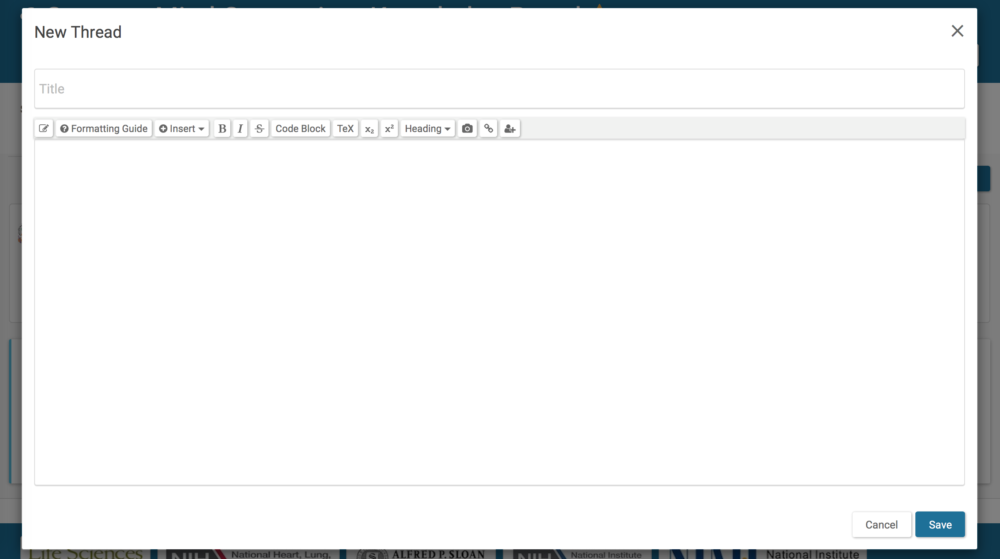
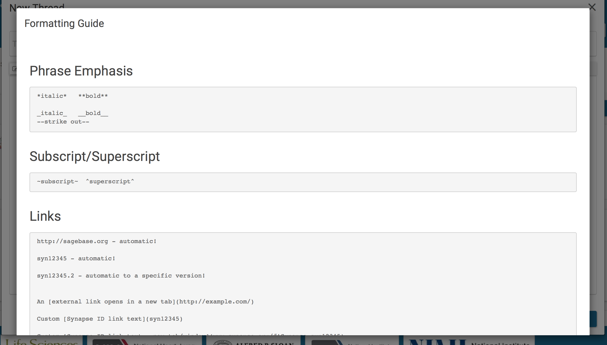
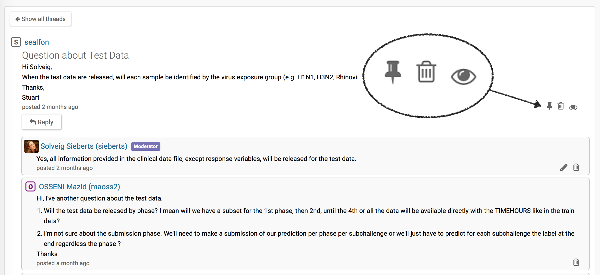

`Discussion` forums are a way to easily communicate with others, similar to a message board, which is visible to all those with whom a project is shared. In this guide you will learn how to:

* Create a new message thread
* Respond to a current thread
* Manage notifications
* Moderate a discussion forum

## Creating a New Message Thread

The `Discussion` tab can be found in the project navigation tabs on your project's main page. Anyone with `Project` access may view discussion threads contained in the project, create new threads, or reply to existing threads.

To create a new thread, click the `New Thread` button at the top of the `Discussion` tab.

This opens a **New Thread** dialog box in which you can edit text, insert pictures, code, TeX, Widgets, or Markdown script. As with `Wiki` editing, a Formatting Guide is available to show you what formatting features are available.



## Responding to Existing Threads

Within an existing thread, you may use the `Reply` button to write a reply to an existing discussion. All editing features described above are available for this purpose.

You may edit or delete any forum post you've created by clicking the **pencil** icon or the **trash can** icon, respectively, located in the bottom right corner of the post.

## Managing Notifications

You may subscribe to a `Discussion` forum for a particular `Project` by clicking the `Follow` button on the main discussion page. Once you've subscribed to a forum, you will receive an email to your Synapse-registered email address whenever a new thread is created or a reply to an existing thread is posted. You can use the `Unfollow` button at any time to discontinue this subscription.

Additionally, you may change notification settings on an individual thread by using the **eye** icon which is visible from within the thread, or by selecting "Follow Thread" or "Unfollow Thread" from the Tools menu. This can be used to stop receiving reply notifications for that individual thread when you've followed all activity in a discussion forum, or to follow activity in only a select thread.

# Moderating a Discussion Forum

## Deleting and Restoring Threads

Project administrators have moderator privileges for discussion forums in all projects to which they have administrator privileges. Moderators may delete threads and replies from all users using the **trash can** icon next to the original post, which deletes the entire thread, or an individual reply, which deletes only that comment, from inside the thread page.

In case of accidental deletion, moderators may also undelete threads to restore them. To view deleted threads, click on "Show Deleted Threads" from the main forum page to see a list of threads that are currently in the trash can. Once you've found the thread you'd like to restore, click into that thread and then use the Tools Menu and select "Restore Thread".

## Pinning Threads

Moderators may also "pin" important threads using the **pin** icon located next to the original post within the thread page. This causes the thread to be highlighted on the top of the thread list on the `Discussion` main page, and to remain at the top of the list even once newer threads are posted. Moderators may also "unpin" threads.

# See Also 

[Wikis](wikis.md)
