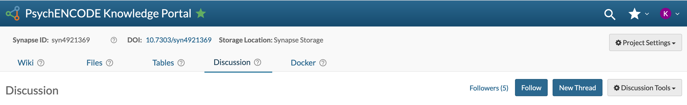
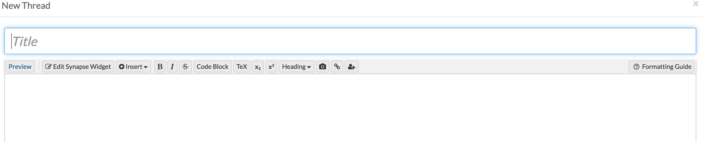

`Discussion` forums are a space to communicate with others, similar to a message board. The forum is visible to users who have access to the `Project`. 
 
### Creating a New Message Thread

The Discussion tab can be found in the Project navigation tabs on the Project main page. Anyone with Project access may view discussion threads contained in the Project, create new threads, or reply to existing threads.

To create a new thread, click the **New Thread** button at the top of the Discussion tab.

This opens a **New Thread** dialog box in which you can edit text, insert pictures, code, TeX, Widgets, or Markdown script. As with `Wiki` editing, a Formatting Guide is available for Markdown, TeX and code block examples. 



 
### Managing Notifications

You may subscribe to a Discussion forum for a particular Project by clicking the **Follow** button on the main discussion page. Once you've subscribed to a forum, you will receive an email to your Synapse-registered email address whenever a new thread is created or a reply to an existing thread is posted. You can use the **Unfollow** button at any time to discontinue this subscription.

Additionally, you may change notification settings on an individual thread by using the **eye** icon which is visible from within the thread, or by selecting **Follow Thread** or **Unfollow Thread** from the Tools menu. This can be used to stop receiving reply notifications for that individual thread when you've followed all activity in a discussion forum, or to follow activity in only a select thread.

 
### Moderating a Discussion Forum

#### Deleting and Restoring Threads

Users have moderator privileges for discussion forums in all projects to which they have administrator privileges. Moderators may delete threads and individual replies from all users using the **trash can** icon next to the original post.

In case of accidental deletion, moderators may also undelete threads to restore them. To view deleted threads, click on **Discussion Tools** and **Show Deleted Threads** to see a list of threads that are currently in the trash can. Once you've found the thread you'd like to restore, click into that thread and use the **Discussion Tools** Menu to select **Restore Thread**.

#### Pinning Threads

Moderators may emphasize important threads by selecting the **pin** icon to bring the post to the top of the forum. The thread will remain at the top of the list even after newer threads are posted. Moderators may also unpin threads.

# See Also 

[Wikis]({{ site.baseurl }})
