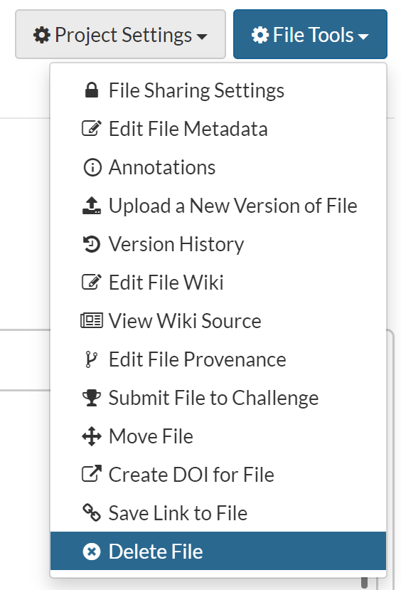

<style>
#image {
    width: 40%;
}
#smallImage {
    width: 20%;
}
#largeImage {
    width: 100%;
}
</style>

Synapse `Files` can be created by uploading or linking to digital files on the web. They are accessible to anyone who has [access](access_controls.md), can be annotated with custom metadata, can be embedded into Synapse `Wiki` pages, and can be associated with a [DOI](doi.md). `Files` carry the Conditions for Use of the Synapse `Folder` they are placed in, plus any additional specific Conditions for Use they have on their own.

By default, `Files` uploaded to Synapse are stored in 'Synapse Storage', which is freely available to you. `Files` can also be stored on your own Amazon S3 bucket (see [Custom Storage Locations](custom_storage_location.md)) or other custom locations. Furthermore, if you don't want to upload a file (it has external restrictions on sharing, is really large, for example) you can also link to the file. In this way, the file will be accessible through the Synapse clients when you are on the computer that the file is stored, but can be annotated, queried, and documented with a Wiki through Synapse. Lastly, you can provide web-accessible links as Synapse files, which will redirect to that location. All of the same Synapse `File` features are available are available on external links as well.

Synapse `Files` (as well as `Folders` and `Projects`) are identified by a unique identifier called a Synapse ID. It takes the form `syn12345678`. This identifier can be used to refer to a specific file on the web and through the clients.

## Uploading a File

##### Web

Navigate to the **Files** tab of the project to which you would like to add the file. Click on the Tools Menu and then on **Upload or Link to File** to upload a local file from your computer or to link to a URL.


##### Command line

```bash
# Add a local file to an existing project (syn12345) on Synapse
synapse store raw_data.txt --parentId syn123456
```

##### Python

```python
import synapseclient
from synapseclient import File
syn = synapseclient.login()

# Add a local file to an existing project (syn12345) on Synapse
file = File(path='/path/to/raw_data.txt', parent='syn12345')
file = syn.store(file)
```

##### R

```r
library(synapser)
synLogin()

# Add a local file to an existing project (syn12345) on Synapse
file <- File(path='/path/to/raw_data.txt', parentId='syn12345')
file <- synStore(file)
```

## Moving a File

All Synapse clients offer a way to move files and folders. Please note that [File Views](views.md) and [sync manifests](uploading_in_bulk.md) **cannot** be used to move files.

The command line client has a sub-command `mv` which can be used to move files and folders. The Python client provides the [syn.move](https://python-docs.synapse.org/build/html/Client.html#synapseclient.Synapse.move) command, and the R client has [synMove()](https://r-docs.synapse.org/reference/synMove.html).

##### Web

Navigate to the file/folder you would like to move. Select **Tools** -> **Move File**. Browse for the new folder/project or enter the synId to move to.

 <span class="glyphicon glyphicon-arrow-right" aria-hidden="true"></span>


##### Command line

```bash
# move a file or folder (syn123) to a different folder/project (syn456)
synapse mv --id syn123 --parentId syn456
```

##### Python

```python
import synapseclient
syn = synapseclient.login()
# fetch the file/folder to move (syn123 in this example)
# note the downloadFile=False parameter to fetch only the file's metadata and not the entire file
foo = syn.get('syn123', downloadFile=False)
# change the parentId to the new location, can be a folder or project (syn456 in this example)
foo.properties.parentId = 'syn456'
# store the file/folder to move it
syn.store(foo)
```

##### R

```r
library(synapser)
synLogin()
# fetch the file/folder to move (syn123 in this example)
# note the downloadFile=False parameter to fetch only the file's metadata and not the entire file
foo <- synGet('syn123', downloadFile = FALSE)
# change the parentId to the new location, can be a folder or project (syn456 in this example)
foo$properties$parentId <- 'syn10056031'
# store the file/folder to move it
synStore(foo)
```

## Deleting a File

Navigate to the file you would like to move. Select **File Tools** -> **Move File** and confirm the deletion.



##### Command line

```bash
synapse delete syn56789
```

##### Python

```python
entity = syn.delete("syn56789")
```

##### R

```r
entity <- synDelete("syn56789")
```

## Versions of Files

Versioning is an important component to reusable, reproducible research. When a Synapse `File` is initially uploaded, it automatically gets a version of `1`. It can be referred to explicitly by its Synapse ID: `syn12345678.1`. Uploading a new version of a file replaces the existing file in Synapse while preserving the previous version. The Synapse ID will remain but the version will increase, e.g., `syn12345678.2`. All versions are accessible through a single entry point (the Synapse ID, `syn12345678`). It is important to note that, by default, any previous versions of the file should still be available - they may be used in provenance relationships or as part of a data release. 

Providing the Synapse ID without any versioning information to any of the clients (e.g., `syn12345678`) will always point to the most recent version of the file. In this way, updates to files can be automatically fetched by users by omitting the version.

If a DOI has been created for a Synapse file, it is automatically versioned as well, so specific versions can be cited in other places.

The easiest way to create a new version of an existing Synapse `File` is to use the same file name and store it in the same location (e.g., the same `parentId`). Synapse will automatically determine that a new version of a file is being stored, only if the contents of the file have changed. If the contents have not changed (e.g., the `md5sum` of the file is identical to the most recent version), a new file will not be uploaded and the version will not increase.

Only the file and annotations information are included in the version. Other metadata about a Synapse `File` (such as the description, name, parent, ACL, *and its associated Wiki*) are not part of the version, and will not change between versions.

## Uploading a New Version

Uploading a new version follows the same steps as uploading a file for the first time - use the same file name and store it in the same location (e.g., the same `parentId`). **It is recommended to add a comment to the new version in order to easily track differences at a glance**. The example file `raw_data.txt` will now have a version of `2` and a comment describing the change.

##### Web

Navigate to the file on Synapse and click the **Tools** button. Select **Upload A New Version Of The File** from the dropdown menu and upload or link to your file in the resulting pop-up.


Once the new version has been uploaded, click the **Tools** button and select the **File History** button. Then select **Edit Version Info** to add the version comment.


##### Command line

```bash
# Upload a new version of raw_data.txt 
synapse store raw_data.txt --parentId syn123456
#Currently there is no option to add a version comment when uploading via command line. We recommend adding the comment via the web client.
```

##### Python

```python
# Upload a new version of raw_data.txt, EXPLICIT UPDATE EXAMPLE
import synapseclient

# fetch the file in Synapse
file_to_update = syn.get('syn2222', downloadFile=False)

# save the local path to the new version of the file
file_to_update.path = '/path/to/new/version/of/raw_data.txt'

# add a version comment
file_to_update.versionComment = 'Added 5 random normally distributed numbers.'

# store the new file
updated_file = syn.store(file_to_update)

# Upload a new version of raw_data.txt, IMPLICIT UPDATE EXAMPLE
# Assuming that there is a file created with: 
syn.store(File('path/to/old/raw_data.txt', parentId='syn123456'))

# To create a new version of that file, make sure you store it with the exact same name
new_file = syn.store(File('path/to/new_version/raw_data.txt',  parentId='syn123456'))
```

##### R

```r
# Upload a new version of raw_data.txt, EXPLICIT UPDATE EXAMPLE
library(synapser)

# fetch the file in Synapse, where "syn2222" is the synID of the file in Synapse
file_to_update <- synGet('syn2222', downloadFile=FALSE)

# save the local path to the new version of the file
file_to_update$path <- '/path/to/new/version/of/raw_data.txt'

# add a version comment
file_to_update$versionComment <- 'Added 5 random normally distributed numbers.'

# store the new file
updated_file <- synStore(file_to_update)

# Upload a new version of raw_data.txt, IMPLICIT UPDATE EXAMPLE
# Assuming that there is a file created with: 
synStore(File('path/to/old/raw_data.txt', parentId='syn123456'))

# To create a new version of that file, make sure you store it with the exact same name
new_file <- synStore(File('path/to/new_version/raw_data.txt',  parentId='syn123456'))
```

## Updating Annotations or Provenance Without Changing Versions

Any change to a `File` will automatically update its version. If this isn't the desired behavior, such as minor cahnges to the metadata, you can set `forceVersion=False` with the Python or R clients. For command line, the commands `set-annotations` and `set-provenance` will update the metadata without creating a new version. Adding/updating annotations and provenance in the web client will also not cause a version change.



**Setting annotations without changing version**

##### Web

Please refer to the [Annotations and Queries](annotation_and_query.md) article for instructions on adding/editing annotations via the web client.

##### Command line

```bash
# Set annotation on file (syn56789)
synapse set-annotations --id syn56789 --annotations '{"fileType":"bam", "assay":"RNA-seq"}'
```

##### Python

```python
# Get file from Synapse, set download=False since we are only updating annotations
file = syn.get('syn56789', download=False)
# Add annotations
file.annotations = {"fileType":"bam", "assay":"RNA-seq"}
# Store the file without creating a new version
file = syn.store(file, forceVersion=False)
```

##### R

```r
# Get file from Synapse, set download=False since we are only updating annotations
file <- synGet('syn56789', downloadFile=FALSE)
# Add annotations
annotations <- synSetAnnotations(file, annotations=list(fileType = "bam", assay = "RNA-seq"))
```

**Setting provenance without changing version**

##### Web
Please refer to the [Provenance](provenance.md) article for instructions on adding/editing annotations via the web client.

##### Command line

```bash
synapse set-provenance -id syn56789 -executed ./path/to/example_code
```

##### Python

```python
# Get file from Synapse, set download=False since we are only updating provenance
file = syn.get('syn56789', download=False)
# Add provenance
file = syn.setProvenance(file, activity = Activity(used = '/path/to/example_code'))
# Store the file without creating a new version
file = syn.store(file, forceVersion=False)
```

##### R

```r
# Get file from Synapse, set download=False since we are only updating annotations
file <- synGet('syn56789', downloadFile=FALSE)
# Add provenance
act <- Activity(name = 'Example Code', used = '/path/to/example_code')
file <- synStore(file, activity=act, forceVersion=FALSE)
```

## Downloading a Specific Version

By default, the `File` downloaded will always be the most recent version. However, a specific version can be downloaded by passing the `version` parameter.

##### Web

Navigate to where the file is stored in Synapse and click the **File History** button to show a list of all versions. Select the version you could like to download and once the page has refreshed, click the blue **Download** button next to the name of the file.


##### Command line

```bash
# Retrieve the first version of a file from Synapse
synapse get syn56789 -v 1
```

##### Python

```python
entity = syn.get("syn56789", version=1)
```

##### R

```r
entity <- synGet("syn56789", version=1)
```

## Deleting a Specific File Version

A specific file version can be deleted by passing the `version` parameter.

##### Command line

```bash
synapse delete syn56789 -v 1
```

##### Python

```python
entity = syn.delete("syn56789", version=1)
```

##### R

```r
# Calling `synDelete` returns NULL
synDelete("syn56789", version = 1)
```

## File Previews

Some files in Synapse are supported with previews to allow users to peek at the contents of the file before they download it. File Previews can also be embedded in Wikis.

## See Also

[Provenance](provenance.md), [Annotations and Queries](annotation_and_query.md), [Downloading Data](downloading_data.md)
