<style>
#image {
    width: 50%;
}
#imageLg {
    width: 60%;
}
#imageXL {
    width: 100%;
}
#imageSmall {
    width: 25%;
}
</style>

Synapse `Tables` are designed to provide users the ability to create web-accessible, sharable, and queryable data. Columns in tables have a user-specified, structured schema. Users define table columns to contain common primitive data types (text, numbers, dates, etc.) or references to other Synapse objects (e.g., `Files`).

`Tables` may be queried and edited through both the Synapse web UI as well as through our programmatic clients. Unlike most NoSQL systems, the data in Synapse `Tables` is strongly consistent, not eventually consistent. This is an important design consideration for scientific data processing, as analysis on eventually-consistent data sources can limit the types of analysis performed, and may require special coding strategies to ensure reasonable accuracy.

To learn more about working with tables using one of our programmatic clients, including code examples for the below tasks, see:

* Tables in [Python Docs](https://python-docs.synapse.org/build/html/Table.html).
* Tables in [R Docs](https://r-docs.synapse.org/articles/tables.html).

# Creating a Table

Tables require structured data, such as that contained in a `.csv` or `.tsv` file. If your structured data is saved in an Excel format such as `.xls` or `.xlsx`, please "save-as" a `.csv` to proceed.

Navigate to the Tables tab on your project. You have the option to create an empty table by clicking on the **Add Table** button under the Tools menu, or to upload your existing data in `.csv` or `.tsv` format by clicking the **Upload a Table** button. If you create an empty table, you'll need to start by defining your schema (see below). If you create a Table by uploading an existing file, first attach your file, click "Save", and then you will be presented with a preview of your data and some advanced options for defining separators and declaring whether or not your first line is a header. Synapse will automatically attempt to detect the table schema based on these options.

After clicking on "Next", you will see the option to rename your Table and, optionally, define your schema more specifically.

## Defining a Schema

Synapse `Tables` require that you specify the types of data in each column included in the `Table`. If you are creating an empty Table, these columns can be specified manually by clicking on **Add Column** and selecting the column type you wish to add. If you are uploading an existing file, Synapse will recommend column types during upload. If you allow Synapse to recommend column types, be sure to verify that these column types represent your data well. You will be presented with a best guess under the button labeled "Schema Options" during import.

Synapse currently supports several kinds of text columns (STRING, LARGE TEXT), dates (as TIMESTAMP), and a variety of numeric columns (INTEGER, DOUBLE), and various Synapse identifiers (ENTITYID, USER). For a complete list of column types and definitions, please see the [REST docs on columnTypes](https://rest-docs.synapse.org/rest/org/sagebionetworks/repo/model/table/ColumnType.html).

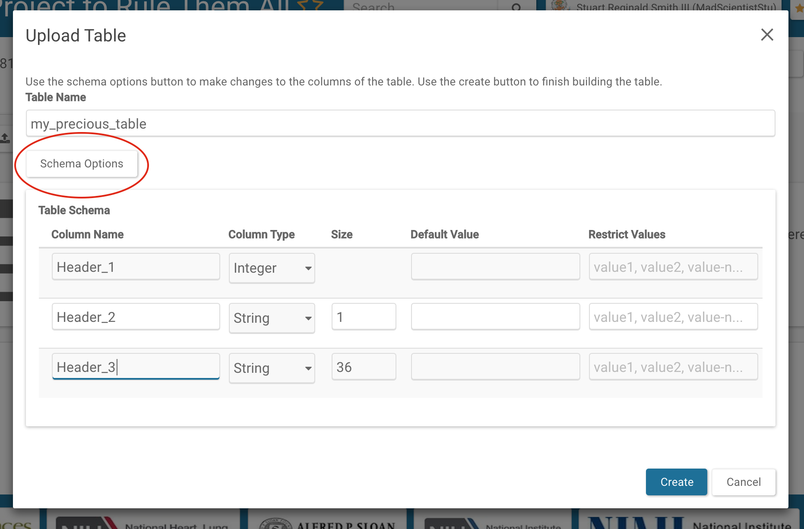

Note: Each programmatic client has a utility function to create columns from a data frame. Please see the [Python Docs](https://python-docs.synapse.org/build/html/Table.html) or [R Docs](https://r-docs.synapse.org/articles/tables.html) for examples.

## Adding Data to Tables

If you have imported an existing `.csv` or `.tsv`, all of your data will be imported at once. For very large files, it may take a while for the Table to be built and indexed completely before it can be used. You can navigate away from the Tables once you have clicked "Create" and you will not lose any data. 

If you have created an empty Table, you will need to click on "Add Data to Table" to upload a `.csv` or `.tsv` file, or add rows individually through the web UI. To add rows, click on the **Edit Query Results** icon to the right of the query button to get to the **Edit Rows** pop-up. From there, you can add rows by clicking the **+** at the top.

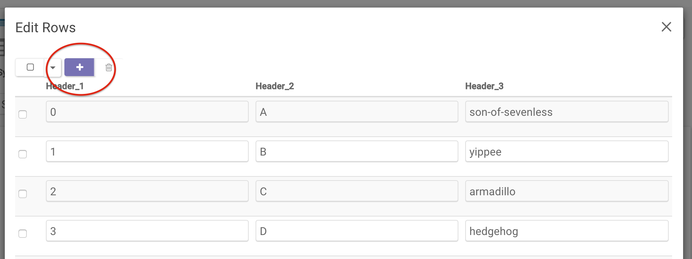

**Deleting rows**

To delete rows, query for the rows you want to delete and use the `delete` function on the results:

Click on the **Edit icon** to the right of the query button to get to the **Edit Rows** pop-up. From there, you can delete rows by checking the boxes of the rows you would like to delete and then clicking the **Trash Can** icon.

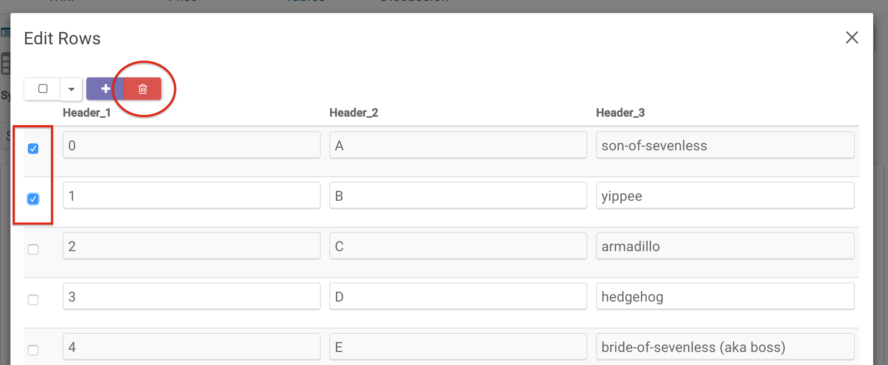

**Modifying existing rows**

To modify row entries, click on the **Edit icon** to the right of the **Query** button. In the resulting pop-up, you can adjust each entry as you please. In this example, the first and last entry of row two have been updated.

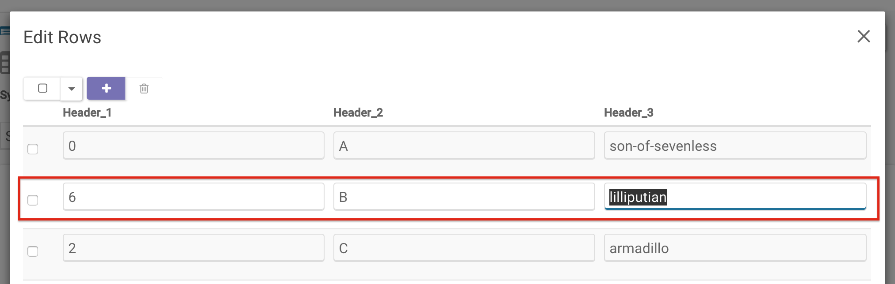

# Modifying Tables

## Changing or Adding Data

Once the schema is settled, changes to the data can be made by adding, appending, and deleting.

When updating, begin by querying the table to ensure you have the latest schema and values.

**Updating existing values**

Click on the **edit** icon to the right of the **Query** button to update table values.

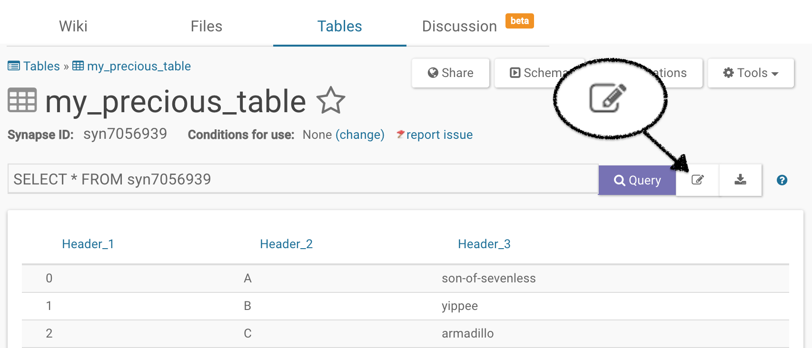

## Changing or Adding Columns

To add columns, click on the **Schema** button. From there, select the **Edit Schema** button and then add columns using the **Add Column** button located at the bottom of the pop-up.

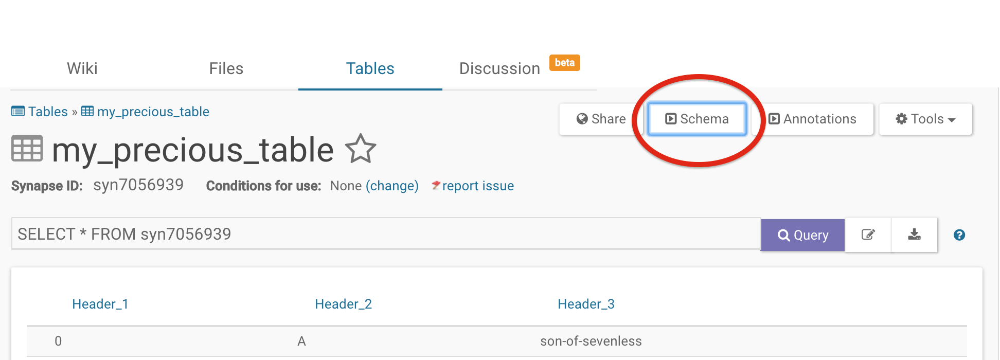



To delete columns, click on the **Schema** button. From there, click the **Edit Schema** button and then select the columns you would like to delete and delete them by clicking the **trash can** icon at the top.

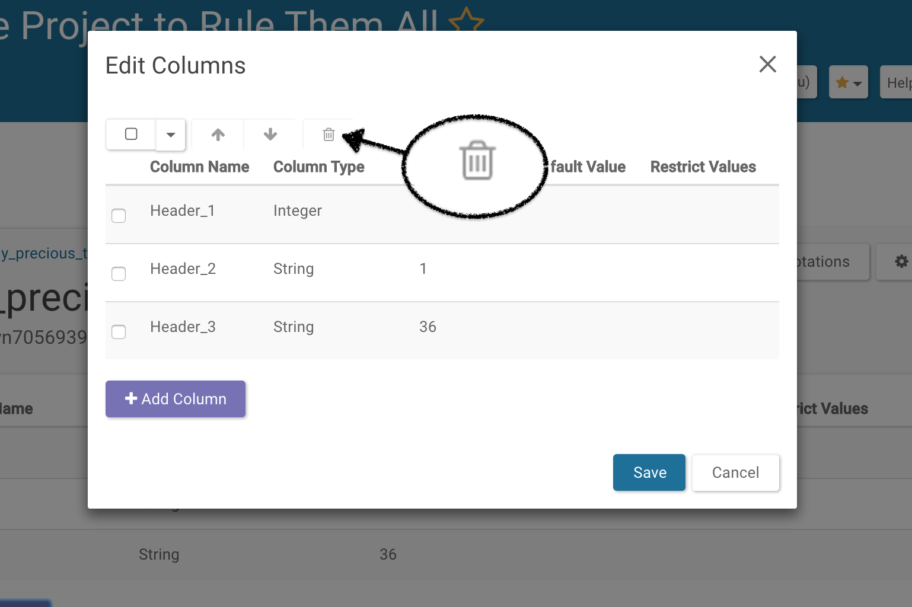

To modify information in a column, first begin by **adding** a new column, then **copy** the data from the column you would like to change into the newly created column, make the changes in the new column, and **delete** the old one.
 In this example, we are chaning the **Column Type** of **Header_1** into **Boolean** and setting the **Default Value** to **true**.

 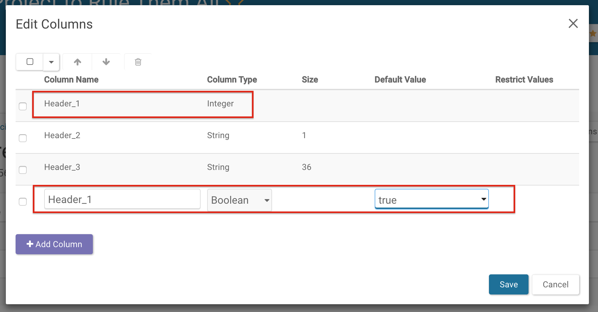

## Deleting the Whole Table

To delete the entire Table, click on **Tools** and then select **Delete Table** from the resulting dropdown.

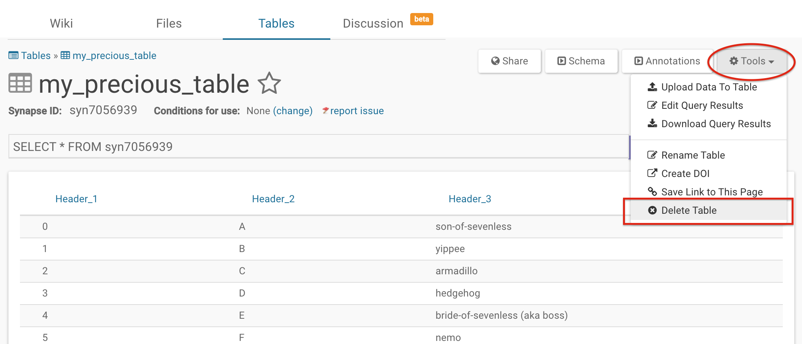

# Querying Table Data

The data contained within a Synapse `Table` can be retrieved by using a SQL-like query language either through the web portal or through the analytical clients. **See the [API docs](http://rest-docs.synapse.org/rest/org/sagebionetworks/repo/web/controller/TableExamples.html) for an enumeration of the types of queries that can be performed.**

## Selecting and Filtering Data

To get all of the columns from a `Table` with id syn3079449, the following query would be used:

```sql
SELECT * FROM syn3079449
```

To get only the two columns called "age" and "gender":

```sql
SELECT age, gender FROM syn3079449
```

To get all columns, but only rows where age is greater that 50:

```sql
SELECT * FROM syn3079449 WHERE age > 50
```

To get all columns, but only rows where age is greater that 50 - and sort by treatmentArm:

```sql
SELECT * FROM syn3079449 WHERE age > 50 ORDER BY "treatmentArm" ASC
```

## Using Advanced SQL Queries to Aggregate Data

More advanced SQL functions are also supported, such as COUNT, SELECT AS, and GROUP_CONCAT statements. Please **see the [API docs](http://rest-docs.synapse.org/rest/org/sagebionetworks/repo/web/controller/TableExamples.html) for an enumeration of the types of queries that can be performed.**

To count the number of rows:

```sql
SELECT count(*) FROM syn3079449
```

To select and rename a subset of columns for use in Wiki widgets:

```sql
SELECT age AS "Age at Diagnosis", gender AS "Gender" FROM syn3079449
```

To find out how many distinct treatment arms were studied, by gender:

```sql
SELECT count(distinct(treatmentArm)) AS "Number of Treatments", gender FROM syn3079449 group by gender
```

To list out the distinct treatent arms that were studied, by gender:

```sql
SELECT GROUP_CONCAT(distinct(treatmentArm) SEPARATOR ', ') AS "Available Treatments", gender as "By Gender" FROM syn3079449 group by gender
```

# Using Table Facets

The faceted navigation on `Tables` (also known as **simple search**) can be used to simplify your search without having to use SQL-like queries. Simple search uses radio buttons and sliders to show all available facets in a menu to the left of the `Table` whereas advanced search employs a SQL-like query to filter the `Table`. To use table facets, navigate to a `Table` or a `File View`. Simple and advanced search both allow you to query for features of interest in a`Table` using different methods.

## Set Facets

In order to use simple search, you must first set columns to be facets in the schema editor. Select **Schema** in the upper right of your table and click on **Edit Schema**. In the resulting pop-up, select **Values** or **Range** from the dropdowns under the **Facet** option. **Values** can be thought of as categories whereas **Range** is a date or number.

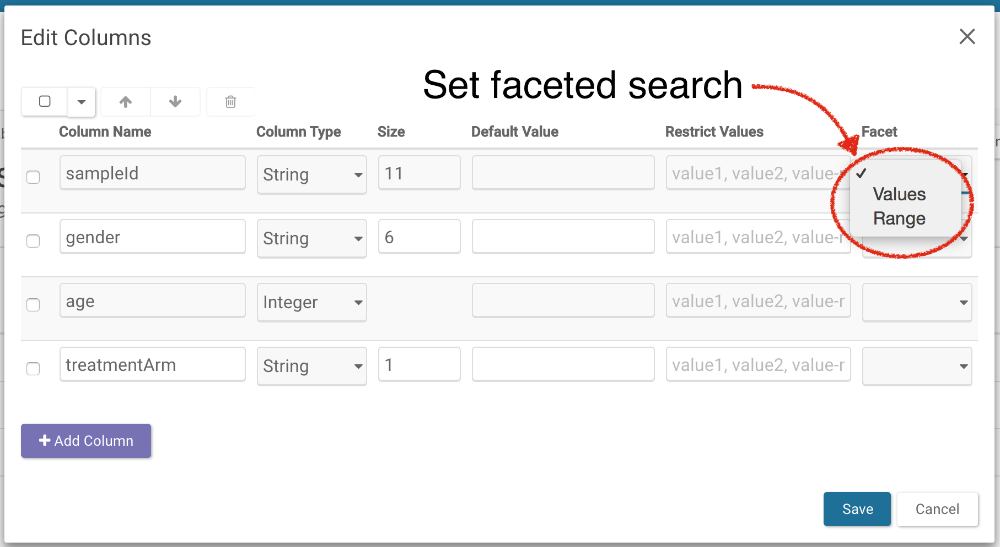



To see all the facets, click on **Show simple search** found above the SQL-query bar:

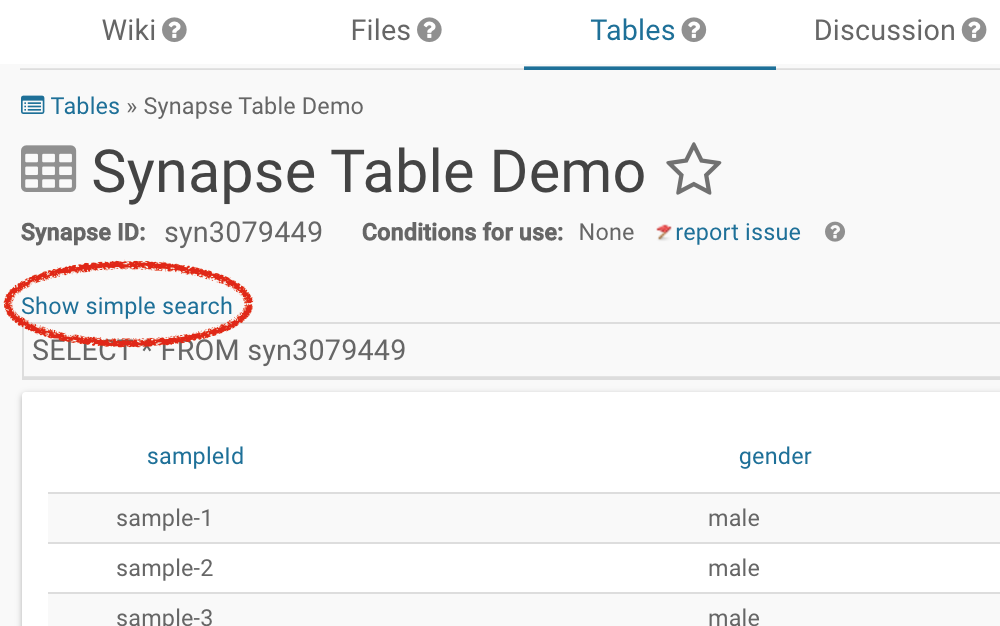

Select the features you are interested in to filter the table.

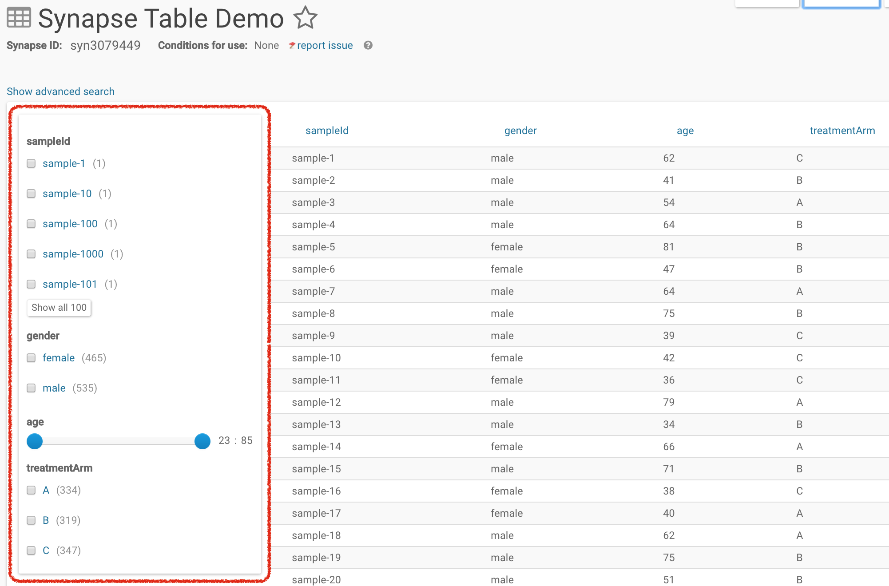

## Toggling between Simple and Advanced Search

You can toggle from the simple search to the advanced search without losing the query results. For example, if in the simple search you had selected treatmentArm `A`, age of `23:64`, and gender as `female`, the query will be preserved in the advanced search bar. However, this is unidirectional because the advanced search allows parameters that are not available with facets. Therefore switching from advanced to simple search will result in resetting the search query.






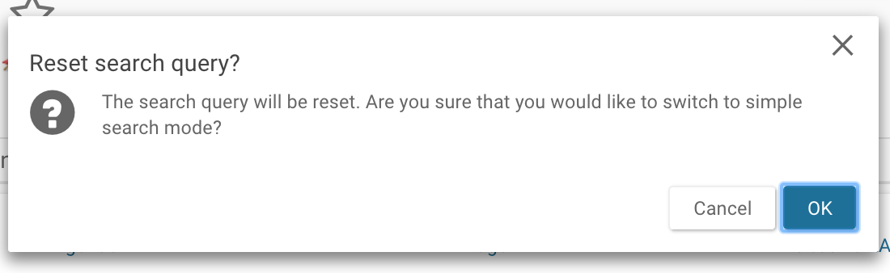

# Working with Files in a Table

Synapse `Tables` support a special column type called `File` which contain a file handle, an identifier of a file stored in Synapse. Here’s an example of how to upload files into Synapse, associate them with a table and read them back later.

First, add a new column for files in the table we're currently working with. To add columns, click on the **Schema** button. From there, select the **Edit Schema** button and then add columns using the **Add Column** button located at the bottom of the pop-up and set the **Column Type** as **File**.


Next, retrieve the most current table and save as a data frame. Click **Save** to save your latest schema.

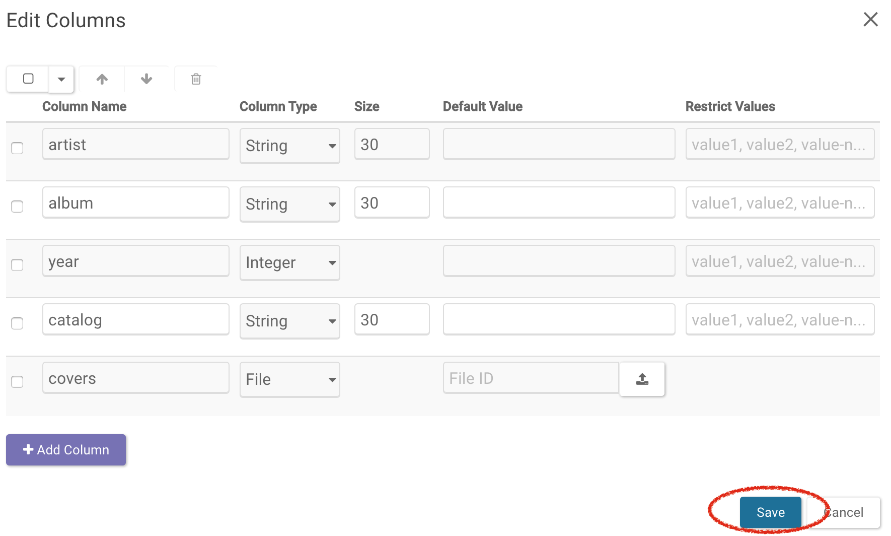

Next, upload the files; click on the **Edit icon** to the right of the **Query** button. In the resulting pop-up, you can upload files by clicking the **Upload icon** then **Browse** and selecting the file from your local directory. Save the new table.

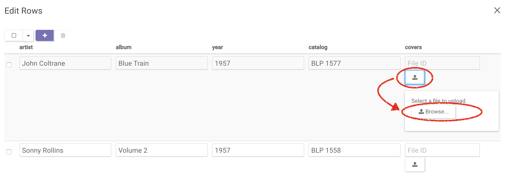

Finally, query the table and download the album cover files. Clicking on any file will download it.

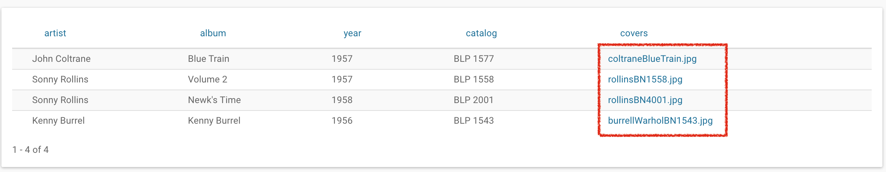

# See Also

[Annotations and Queries](annotation_and_query.md), [Downloading Data](downloading_data.md), [Files and Versioning](files_and_versioning.md)
