<style>
#image {
    width: 35%;
}
#tableImage {
    width: 65%;
}
#tableImage:hover {
    transform: scale(3.0);
    outline: 1px solid #1e7098;
}
#image:hover {
    transform: scale(3.0);
    outline: 1px solid #1e7098;
}
</style>

`Wikis` provide a space to write narrative content to describe a project or content within the project. They are available in Synapse on `Projects`, `Folders`, and `Files`. Every Project has a separate Wiki tab where you can create pages and a hierarchy of sub-pages.

Wiki pages can be written using text, [Markdown](https://www.markdownguide.org/), or basic HTML. Additionally, you can embed dynamic content based on other resources stored in Synapse.

A Wiki inherits it's [sharing settings](https://docs.synapse.org/articles/sharing_settings.html) from the Project, Folder, or File it is associated with, and cannot have separate sharing settings. Anyone with 'view' permissions or greater can see the content of the Wiki page. When a Project, Folder or File is shared with the public, the associated Wiki is visible to viewers who are not logged in to Synapse.

## Creating, Editing, and Deleting a Wiki

### Through a Web Browser

After creating a new project, select the Wiki tab. Start a Wiki through the Tools menu by selecting the **Edit Project Wiki** function. Content in this first Wiki becomes your Project's home page. Go to the Tools menu to add subpages to your Wiki. These will appear as links on the left side of your home page. Adding a Wiki to a Folder or File is done in a similar manner by selecting 'Edit Folder/File Wiki'. Content added to a Wiki can be previewed before saving. Each version of a saved Wiki is visible under Wiki History where older versions can be restored. To delete a `Wiki` select **Delete Wiki Page** under Tools.  

Use the **Tools** menu and then select **Edit Project/Folder/File wiki**

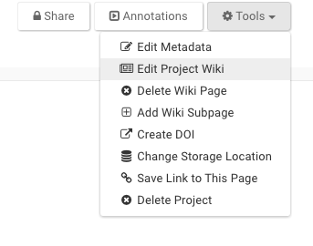

##### Command Line

The command line client does not support the creation of Wiki content. We suggest using (to get to the webpage of the project) `synapse onweb syn###` where `syn###` is the Synapse Id of your created project. Then editing the Wiki using the web client.

##### Python

```python
projWiki = Wiki(title='Data Summary', owner = myProj)
markdownText = '''* Cell growth look normally distributed. There is evidence of inverse growth between these two cell lines '''
projWiki['markdown'] = markdownText
projWiki = syn.store(projWiki)
```

##### R

```r
library(synapser)
synLogin()
markdownText <- "* Cell growth look normally distributed\n* There is evidence of inverse growth between these two cell lines."
wiki <- Wiki(owner="syn123", title="Analysis summary", markdown=markdownText)
wiki <- synStore(wiki)
```

## Wiki Subpages

A Project Wiki can have subpages, which will appear nested below the main Wiki page. This will also create a navigation bar on the right side of the page that lists the Wiki subpages in the order they were created. Links to wiki subpages include the Project ID, the wiki path, and the ID of the wiki page, e.g. https://www.synapse.org/#!Synapse:syn150935/wiki/27376. The subpage ID can be found in the browser URL bar when the subpage is viewed.

To add a subpage, use the **Tools** menu and then click **Add Wiki Subpage**. You can then edit this sub-page like any other Wiki page through the **Tools** menu and **Edit Project Wiki**.

These pages can be reordered through the **Edit Order** button below the Wiki page navigation bar to change both the hierarchy and the order of pages within a particular level.

## Wiki Markdown Language

The layout and text of a Wiki can be customized using standard Markdown notation. A Formatting Guide is available within the Wiki editing window. For a reference of Markdown formatting see the [Markdown Formatting Guide](https://www.synapse.org/#!Wiki:syn2467792/ENTITY/64247). Useful Markdown shortcuts are available in the Wiki Editor in a tool bar including: heading, bold, italic, strike-through, code block, sub and superscript. Links can be added to content available from any source with a URL.

## Wiki Widgets

Widgets are Synapse features that supplement the Markdown text that can be typed into the Wiki editor. These include inserting images, tagging individuals, querying tables, and many more. See the 'Insert' menu while in the Wiki editor for the list of widgets to customize your Wiki.

See the 'Insert' list for the following widgets to customize your Wiki design.

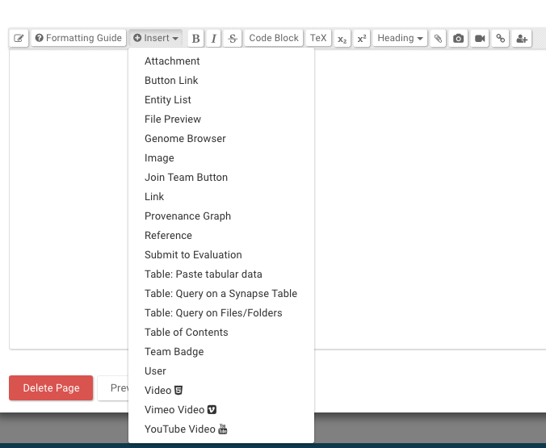



{:.markdown-table}
| Widget | Hover over the image to see what the widget will look like when embedded in your project |
| -- | :--: |
| **References** <br/> Create a reference list by linking to papers using the References widget | 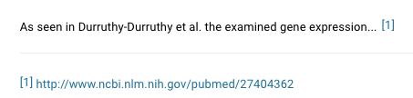 |
| **File Preview** <br/> Embeds a preview window for csv, txt and image files||
| **Image** <br/> Embeds an JPG, PNG, GIF or SVG. The image can be uploaded, from the web, or from a Synapse file. **Note:** Images file names that have certain words (ie, 'ad') could be blocked if you are using an adblocker. ||
| **Provenance** <br/> Embeds the provenance graph created for a file |  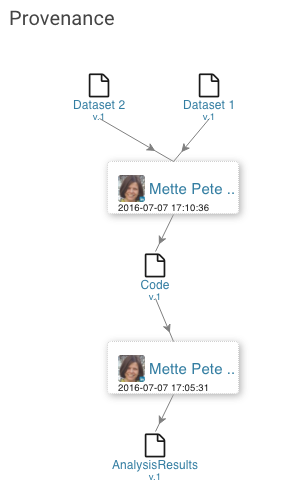 |
| **Table of Contents** <br/> Creates a content list that links to sections of the wiki based on headers and subheaders |  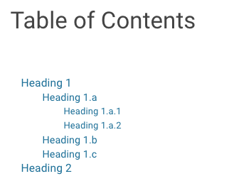 |
| **Entity List** <br/> A list of Synapse Folders, Files or Tables can be easily created by browsing to the Synapse location or searching by entity name or Synapse ID. The table lists entity name, date entity was created, who created it, and for Files and Tables - version and version notes|  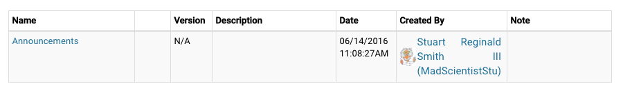 |
| **Table: Paste tabular data** <br/> A table can be created of any data by pasting tab delimited content into this widget window.  |  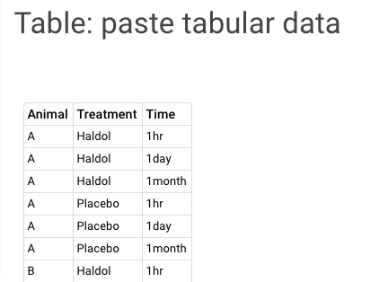 |
| **Table: Query on a Synapse `Table`** <br/> Provides a Query for any Synapse Table and displays the information in the Wiki. |  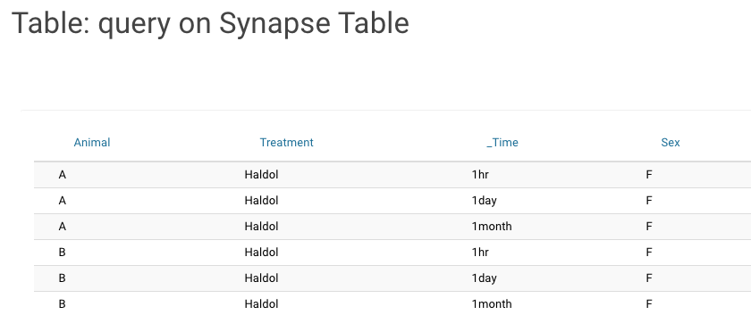 |
| **Query on `Files`/`Folders`** <br/> Provides a Query based an annotations (need link) added to Files and Folders. Columns in the Query table can be renamed and ordered through the 'Add Column Renderer' | 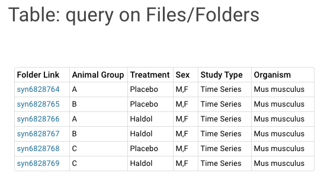 |
| **Button Link** <br/> Insert a button that links to content within Synapse or elsewhere. **Tip:** buttons can be colored purple by adding `'&highlight=true'` to the end of the widget markdown |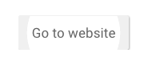|
| **Join Team Button** <br/> Provide a button for people to join Synapse [Teams](teams.md) | 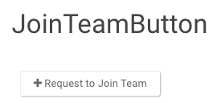 |
| **Team Badge** <br/> Creates a link to the `Team` profile | 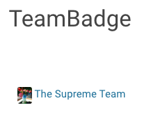 |
| **Genome Browser** <br/> You can add a [Biodalliance genome browser](http://www.biodalliance.org) using tracks from files uploaded to Synapse or from external sources. Choose between Human or Mouse and adjust your tracks for height and color. See the Biodalliance Setup page for [more information](genome_browser.md) | 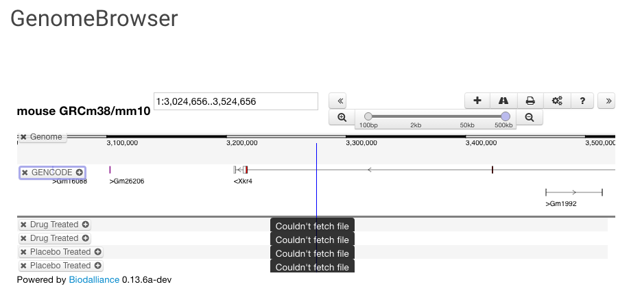 |
| **Video** <br/> Video, Vimeo Video, and YouTube Video insert a video from various sources. | 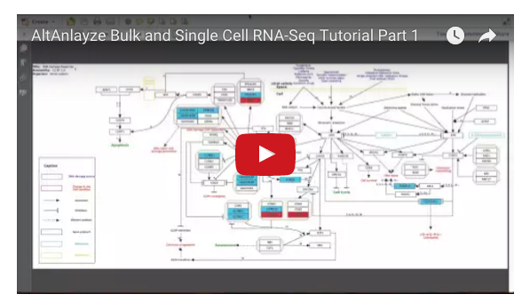 |

## Tagging Synapse Users

A Synapse user can be tagged by using the 'Tag someone' Widget from the 'Insert' menu. This displays a user badge which can be clicked on to visit the users' profile page. You can also do this by typing '@' while editing a Wiki by entering the Synapse username or part of their full name in the dialog that appears.

## Governance



See the Synapse Data Use Procedure document for [details](https://s3.amazonaws.com/static.synapse.org/governance/SageBionetworksSynapseTermsandConditionsofUse.pdf?v=4).

## See Also

[Discussion](discussion.md)
