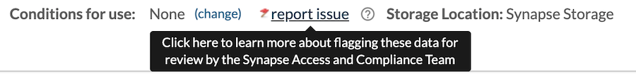

Data shared in Synapse may have `Conditions for Use` that define restrictions on how it may be disclosed or what the data set may contain based on privacy laws or regulation.

You must be a `Certified User` to contribute data to Synapse. You are responsible for determining if the data you would like to contribute is `Controlled Use` and therefore requires `Conditions for Use`. Carefully consider the specific risks and appropriate protections required before sharing your data.

If there are no ethical, legal or regulatory reasons to impose `Conditions for Use`, the data can be used for any lawful research purpose. All human data shared in Synapse, with or without `Conditions for Use`, must be de-identified according to **HIPAA standards** and comply with all applicable privacy laws and regulations. Guidance on de-identification according to HIPAA rules can be found [here](http://www.hhs.gov/ocr/privacy){:target="_blank"}.

`Conditions for Use` can be set at the `Project`, `Folder`, `File` and `Table` level. We recommend grouping `Files` that require the same `Conditions for Use` in a dedicated `Folder` within your `Project`. For more information about setting `Conditions for Use` please see [Access Controls and Data Governance](access_controls.md).

# Accessing Data

Both `Registered` and `Certified` users can view, download, and use data that do not have `Conditions for Use`.

## How do you access data with Conditions for Use? 

To access `Controlled Use` data you must fulfill the `Conditions for Use` set by the data contributor. On the entity page, select the orange `Show unmet conditions` box in the center of the header to open a dialog box with directions to meet the `Conditions for Use`. In many cases, access requires that you read and agree to data-specific terms electronically in a clickwrap contract. Occasionally, access to `Controlled Data` requires additional steps, like having your analysis plan approved by an ethics board or IRB.

### Bridge Data

Synapse houses data collected through research apps. This data is called Bridge data. This data has been donated by thousands of volunteers
from around the world. Bridge data is only accessible to Users with a `Validated Profile`. To learn more see [Synapse User Credentials](accounts_certified_users_and_profile_validation.md#validated-profile).


Sharing a Synapse account violates the Synapse Terms of Use. Each user wishing to access `Controlled Data` must individually agree to the `Conditions for Use` to access the data. **Please be mindful when sharing information. Do not send data or metadata via email.**

## Flagging Inappropriate Data Use

If you believe the data made available in Synapse have been posted inconsistently with the associated `Conditions for Use`, use the **Report Issue** flag in the header of the relevant file, table or folder.

Flagging the data in this way will alert the Access and Compliance Team who will contact you for more detail. You may also email the Access and Compliance Team at act@sagebase.org directly to report possible incidents.
