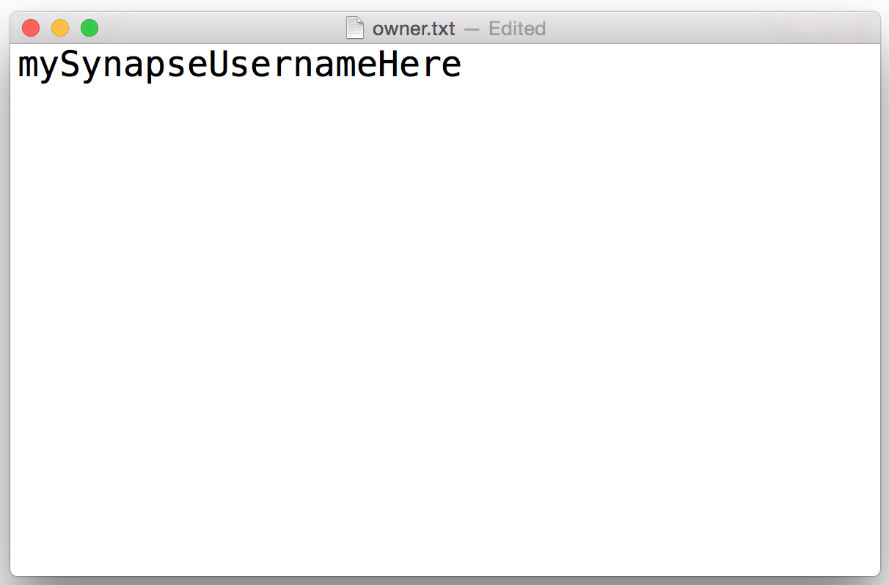
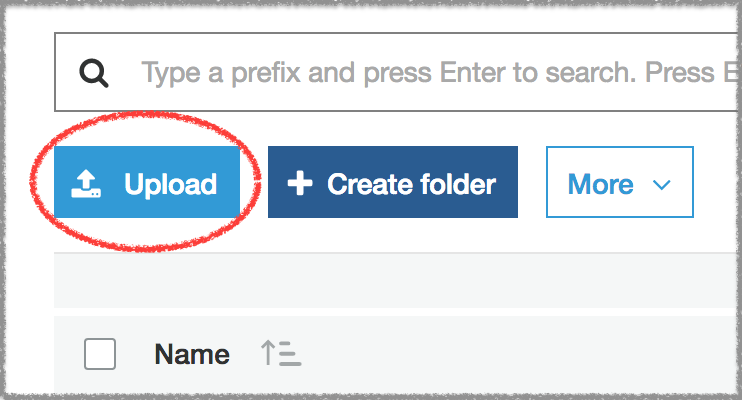
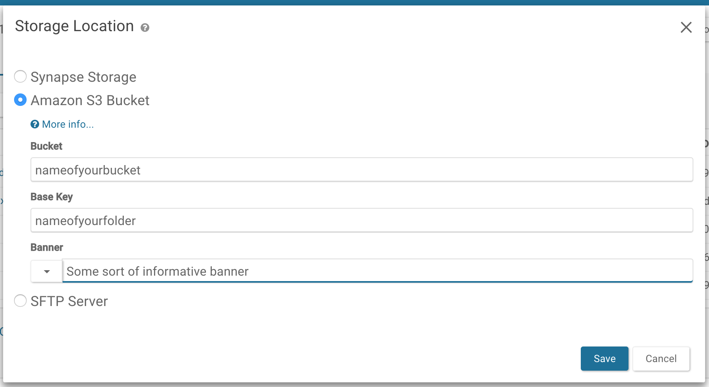

<style>
#image {
    width: 100%;
}
#imageSmall {
    width: 40%;
}
</style>

While Synapse provides physical storage for files (using Amazon's S3), not all data 'in' Synapse is stored on Synapse controlled locations. For example, data files can physically reside on a user-owned S3 bucket, SFTP servers, or a local file server using a proxy servers. Creating a custom storage location allows users ownership and control of their files, especially in cases where there is a large amount of data or cases where there are additional restrictions that need to be set on the data.




## Setting Up an External AWS S3 Bucket
There are two ways to setup an External AWS S3 Bucket.

* [Setup with AWS Console](#setup-with-aws-console) - Manual setup using the [AWS Console].
* [Setup with AWS Cloudformation](#setup-with-cloudformation) - Automated setup using [AWS Cloudformation].

Follow the documentation on Amazon Web Service (AWS) site to **[Create a Bucket](http://docs.aws.amazon.com/AmazonS3/latest/gsg/CreatingABucket.html)**. Buckets are not required to be located in the US.

<a href="http://docs.aws.amazon.com/AmazonS3/latest/gsg/CreatingABucket.html" class="btn btn-primary">View AWS Bucket Instructions</a>

Make the following adjustments to customize it to work with Synapse:  

* When the AWS instructions prompt you to `Create a Bucket - Select a Bucket Name and Region`, use a unique name. For example, `thisisthenameofmybucket`.
* Select the newly created bucket and click the **Permissions** tab.
  * Select the **Bucket Policy** button and copy one of the below policies (read-only or read-write permissions). Change the name of `Resource` from “synapse-share.yourcompany.com” to the name of your new bucket (twice) and ensure that the `Principal` is `"AWS":"325565585839"`. This is Synapse's account number.

### Read-write permissions

To allow authorized Synapse users to upload data to your bucket set read-write permissions need to be set on that bucket (you allow Synapse to upload and retrieve files):

```json
{
    "Statement": [
        {
            "Action": [ "s3:ListBucket*", "s3:GetBucketLocation" ],
            "Effect": "Allow",
            "Resource": "arn:aws:s3:::thisisthenameofmybucket",
            "Principal": { "AWS": "325565585839" }
        },
        {
            "Action": [ "s3:*Object*", "s3:*MultipartUpload*" ],
            "Effect": "Allow",
            "Resource": "arn:aws:s3:::thisisthenameofmybucket/*",
            "Principal": { "AWS": "325565585839" }
        }
    ]
}
```

For **read-write** permissions, you also need to create an object that proves to the Synapse service that you own this bucket. This can be done by creating an **[owner.txt](../assets/downloads/owner.txt)** file with your Synapse username and uploading it to your bucket. You can upload the file with the Amazon Web Console or if you have  the [AWS command line client](https://aws.amazon.com/cli/), you can upload using the command line.



##### Command line

```bash
# copy your owner.txt file to your s3 bucket
aws s3 cp owner.txt s3://nameofmybucket/nameofmyfolder
```

##### Web



Navigate to your bucket on the Amazon Console and select **Upload** to upload your text file.

### Read-only permissions

If you do not want to allow authorized Synapse users to upload data to your bucket but provide read access you can change the permissions to read-only:

```json
{
    "Statement": [
        {
            "Action": [ "s3:ListBucket*", "s3:GetBucketLocation" ],
            "Effect": "Allow",
            "Resource": "arn:aws:s3:::synapse-share.yourcompany.com",
            "Principal": { "AWS": "325565585839" }
        },
        {
            "Action": [ "s3:GetObject*", "s3:*MultipartUpload*" ],
            "Effect": "Allow",
            "Resource": "arn:aws:s3:::synapse-share.yourcompany.com/*",
            "Principal": { "AWS": "325565585839" }
        }
    ]
}
```

### Make sure to enable cross-origin resource sharing (CORS)

In **Permissions**, click **CORS configuration**. In the CORS configuration editor, edit the configuration so that Synapse is included  in the `AllowedOrigin` tag. An example CORS configuration that would allow this is:

```html
<CORSConfiguration>
    <CORSRule>
        <AllowedOrigin>*</AllowedOrigin>
        <AllowedMethod>GET</AllowedMethod>
        <AllowedMethod>POST</AllowedMethod>
        <AllowedMethod>PUT</AllowedMethod>
        <AllowedMethod>HEAD</AllowedMethod>
        <MaxAgeSeconds>3000</MaxAgeSeconds>
        <AllowedHeader>*</AllowedHeader>
    </CORSRule>
</CORSConfiguration>
```

For more information, please read: [How Do I Configure CORS on My Bucket?](https://docs.aws.amazon.com/AmazonS3/latest/dev/cors.html#how-do-i-enable-cors)


### Setup with AWS Cloudformation

For convienance [AWS Cloudformation] can be used to provision a custom AWS S3 bucket for use with Synapse.
Using this approach will result in the exact same bucket as described in [Setup with AWS Console](#setup-with-aws-console).

Instructions:
1. Download the [CF template](https://github.com/Sage-Bionetworks/scicomp-provisioner/blob/master/templates/SynapseExternalBucket-v2.yaml).
2. Use the [AWS Command Line](https://docs.aws.amazon.com/cli/latest/reference/cloudformation/index.html) or
[AWS Console](https://console.aws.amazon.com/cloudformation/home?region=us-east-1#/stacks/create) to execute the
template which will automatically provision the bucket.

Example using the the `awscli`:
```
aws cloudformation create-stack \
--stack-name MyCustomSynapseBucket \
--template-body file://SynapseExternalBucket.yaml \
--parameters ParameterKey=Department,ParameterValue=Cancer ParameterKey=Project,ParameterValue=Mammography \
ParameterKey=OwnerEmail,ParameterValue=joe.smith@company.com ParameterKey=SynapseUserName,ParameterValue=jsmith
```

The above example shows required parameters:
* Department - An department tag.  Can be any arbitarty text
* Project -   An project tag.  Can be any arbitarty text
* OwnerEmail - An bucket owner tag.  A valid email.
* SynapseUserName - The Synapse account user name.
__Note__: Department, Project, OwnerEmail are only used to
[tag the bucket](https://docs.aws.amazon.com/AWSCloudFormation/latest/UserGuide/aws-properties-resource-tags.html)
and can be arbitrary.


The following are optional parameters:
```
# (Optional) true for read-write, false (default) for read-only bucket
AllowWriteBucket: 'true'
# (Optional) true (default) to encrypt bucket, false for no encryption
EncryptBucket: 'false'
# (Optional) 'Enabled' to enable bucket versioning, default is 'Suspended'
BucketVersioning: 'Enabled'
# (Optional) 'Enabled' to enable bucket data life cycle rule, default is 'Disabled'
EnableDataLifeCycle: 'Enabled'
# (Optional) S3 bucket objects will transition into this storage class: GLACIER(default), STANDARD_IA, ONEZONE_IA
LifecycleDataStorageClass: 'STANDARD_IA'
# (Optional) Number of days until S3 objects are moved to the LifecycleDataStorageClass, default is 30
LifecycleDataTransition: '90'
# (Optional) Number of days (from creation) when objects are deleted from S3 and LifecycleDataStorageClass, default is 365000
LifecycleDataExpiration: '1825'
# (Optional) Restrict downloading files from this bucket to only AWS resources (e.g. EC2 , Lambda) within the same region as this bucket. default is false.
SameRegionResourceAccessToBucket: 'true'
```

After executing the cloudformation command view the
[AWS cloudformation dashboard](https://console.aws.amazon.com/cloudformation/home)
to verify whether the bucket was provisioned successfully.

### Set S3 Bucket as Upload Location

By default, your `Project/Folder` uses Synapse storage. You can use the external bucket configured above via our programmatic clients or web client.

##### Python

```python
# Set storage location
import synapseclient
import json
syn = synapseclient.login()
PROJECT = 'syn12345'

destination = {'uploadType':'S3',
               'concreteType':'org.sagebionetworks.repo.model.project.ExternalS3StorageLocationSetting',
               'bucket':'nameofyourbucket'}
destination = syn.restPOST('/storageLocation', body=json.dumps(destination))

project_destination ={'concreteType': 'org.sagebionetworks.repo.model.project.UploadDestinationListSetting',
                      'settingsType': 'upload'}
project_destination['locations'] = [destination['storageLocationId']]
project_destination['projectId'] = PROJECT

project_destination = syn.restPOST('/projectSettings', body = json.dumps(project_destination))
```

##### R

```r
#set storage location
library(synapser)
synLogin()
projectId <- 'syn12345'

destination <- list(uploadType='S3',
                    concreteType='org.sagebionetworks.repo.model.project.ExternalS3StorageLocationSetting',
                    bucket='nameofyourbucket')
destination <- synRestPOST('/storageLocation', body=toJSON(destination))

projectDestination <- list(concreteType='org.sagebionetworks.repo.model.project.UploadDestinationListSetting',
                           settingsType='upload')
projectDestination$locations <- list(destination$storageLocationId)
projectDestination$projectId <- projectId

projectDestination <- synRestPOST('/projectSettings', body=toJSON(projectDestination))
```

##### Web

 Navigate to your **Project/Folder -> Tools -> Change Storage Location**. In the resulting pop-up, select the `Amazon S3 Bucket` option and fill in the relevant information, where Bucket is the name of your external bucket, Base Key is the name of the folder in your bucket to upload to, and Banner is a short description such as who owns the storage location:



### Adding Files in Your S3 Bucket to Synapse

If your bucket is set for read-write access, files can be added to the bucket using the standard Synapse interface (web or programmatic).

If the bucket is read-only or you already have content in the bucket, you will have to add representations of the files in Synapse programmatically. This is done using a `FileHandle`, which is a Synapse representation of the file.

##### Python

```python
# create filehandle
fileHandle = {'concreteType': 'org.sagebionetworks.repo.model.file.S3FileHandle',
              'fileName'    : 'nameOfFile.csv',
              'contentSize' : "sizeInBytes",
              'contentType' : 'text/csv',
              'contentMd5' :  'md5',
              'bucketName' : destination['bucket'],
              'key' : 's3ObjectKey',
              'storageLocationId': destination['storageLocationId']}
fileHandle = syn.restPOST('/externalFileHandle/s3', json.dumps(fileHandle), endpoint=syn.fileHandleEndpoint)

f = synapseclient.File(parentId=PROJECT, dataFileHandleId = fileHandle['id'])

f = syn.store(f)
```

##### R

```r
# create filehandle
fileHandle <- list(concreteType='org.sagebionetworks.repo.model.file.S3FileHandle',
                   fileName    = 'nameOfFile.csv',
                   contentSize = 'sizeInBytes',
                   contentType = 'text/csv',
                   contentMd5 =  'md5',
                   storageLocationId = destination$storageLocationId,
                   bucketName = destination$bucket,
                   key ='s3ObjectKey')
fileHandle <- synRestPOST('/externalFileHandle/s3', body=toJSON(fileHandle), endpoint = synapseFileServiceEndpoint())

f <- File(dataFileHandleId=fileHandle$id, parentId=projectId)

f <- synStore(f)
```
Please see the [REST docs](http://docs.synapse.org/rest/org/sagebionetworks/repo/model/project/ExternalS3StorageLocationSetting.html) for more information on setting external storage location settings using our REST API.

## Setting Up an External Google Cloud Storage Bucket

Follow the documentation on Google Cloud's site to **[Create a Bucket](https://cloud.google.com/storage/docs/creating-buckets)**.

Make the following adjustments to customize it to work with Synapse:  

* Select the newly created bucket and click the **Permissions** tab.
* Select the **Add members** button and enter the member `synapse-svc-prod@uplifted-crow-246820.iam.gserviceaccount.com`. This is Synapse's service account. Give the account the permissions "Storage Legacy Bucket Reader" and "Storage Object Viewer" for read permission. To allow Synapse to upload files, additionally grant the "Storage Legacy Bucket Writer" permission.

For **read-write** permissions, you also need to create an object that proves to the Synapse service that you own this bucket. This can be done by creating an **<a href="../assets/downloads/owner.txt" download="owner.txt">owner.txt</a>** file with your Synapse username and uploading it to your bucket. You can upload the file with the Google Cloud Platform Console, or using the command line [gsutil application](https://cloud.google.com/storage/docs/gsutil).


##### Command line

```console
# copy your owner.txt file to your s3 bucket
gsutil cp owner.txt gs://nameofmybucket/nameofmyfolder
```

##### Web

Navigate to your bucket on the Google Cloud Console and select the **Upload files** button to upload your text file.

### Make sure to enable cross-origin resource sharing (CORS)

Follow the instructions for [Setting CORS on a bucket](https://cloud.google.com/storage/docs/configuring-cors. You may have to install the [gsutil application](https://cloud.google.com/storage/docs/gsutil).

The configuration must include Synapse as a permitted `origin`. An example CORS configuration that would allow this is:

```json
[
    {
        "maxAgeSeconds": 3000,
        "method": ["GET", "POST", "PUT", "HEAD"],
        "origin": ["*"],
        "responseHeader": ["Content-Type"]
    }
]
```

Using **gsutil**, you can set the CORS configuration with the command:

```console
gsutil cors set cors-json-file.json gs://example-bucket
```

where `cors-json-file.json` is a local file that contains a valid CORS configuration.

For more information, please read: [Configuring cross-origin resource sharing (CORS)](https://cloud.google.com/storage/docs/configuring-cors).

### Set Google Cloud Bucket as Upload Location

By default, your Project uses Synapse storage. You can use the external bucket configured above via our programmatic clients or web client.

##### Python

```python
# Set storage location
import synapseclient
import json
syn = synapseclient.login()
PROJECT = 'syn12345'

destination = {'uploadType':'GOOGLECLOUDSTORAGE', 
               'concreteType':'org.sagebionetworks.repo.model.project.ExternalGoogleCloudStorageLocationSetting',
               'bucket':'nameofyourbucket'}
destination = syn.restPOST('/storageLocation', body=json.dumps(destination))

project_destination ={'concreteType': 'org.sagebionetworks.repo.model.project.UploadDestinationListSetting', 
                      'settingsType': 'upload'}
project_destination['locations'] = [destination['storageLocationId']]
project_destination['projectId'] = PROJECT

project_destination = syn.restPOST('/projectSettings', body = json.dumps(project_destination))
```

##### R

Please see the [REST docs](http://docs.synapse.org/rest/org/sagebionetworks/repo/model/project/ExternalS3StorageLocationSetting.html) for more information on setting external storage location settings using our REST API.

## Setting Up an External Google Cloud Storage Bucket

Follow the documentation on Google Cloud's site to **[Create a Bucket](https://cloud.google.com/storage/docs/creating-buckets)**.

Make the following adjustments to customize it to work with Synapse:  

* Select the newly created bucket and click the **Permissions** tab.
    * Select the **Add members** button and enter the member `synapse-svc-prod@uplifted-crow-246820.iam.gserviceaccount.com`. This is Synapse's service account. Give the account the permissions "Storage Legacy Bucket Reader" and "Storage Object Viewer" for read permission. To allow Synapse to upload files, additionally grant the "Storage Legacy Bucket Writer" permission.


<br/>

For **read-write** permissions, you also need to create an object that proves to the Synapse service that you own this bucket. This can be done by creating an **<a href="../assets/downloads/owner.txt" download="owner.txt">owner.txt</a>** file with your Synapse username and uploading it to your bucket. You can upload the file with the Google Cloud Platform Console, or using the [gsutil application](https://cloud.google.com/storage/docs/gsutil), you can upload using the command line. 


##### Command line

```bash
# copy your owner.txt file to your s3 bucket
gsutil cp owner.txt gs://nameofmybucket/nameofmyfolder
```

##### Web

Navigate to your bucket on the Google Cloud Console and select the **Upload files** button to upload your text file.

<br/>

### Make sure to enable cross-origin resource sharing (CORS)
Follow the instructions for [Setting CORS on a bucket](https://cloud.google.com/storage/docs/configuring-cors). You may have to insall the [gsutil application](https://cloud.google.com/storage/docs/gsutil).

Using **gsutil**, you can set the CORS configuration with the command 

```
gsutil cors set cors-json-file.json gs://example-bucket
```

Where cors-json-file.json is a local file that contains a valid CORS configuration, like the configuration below. The configuration must include Synapse as a permitted `origin`. An example CORS configuration that would allow this is:

```json
[
    {
        "maxAgeSeconds": 3000,
        "method": ["GET", "POST", "PUT", "HEAD"],
        "origin": ["*"],
        "responseHeader": ["Content-Type"]
    }
]
```

<br/>
For more information, please read: [Configuring cross-origin resource sharing (CORS)](https://cloud.google.com/storage/docs/configuring-cors)

### Set Google Cloud Bucket as Upload Location

By default, your `Project` uses Synapse storage. You can use the external bucket configured above via our programmatic clients or web client.

##### Python

```python
# Set storage location
import synapseclient
import json
syn = synapseclient.login()
PROJECT = 'syn12345'

destination = {'uploadType':'GOOGLECLOUDSTORAGE', 
               'concreteType':'org.sagebionetworks.repo.model.project.ExternalGoogleCloudStorageLocationSetting',
               'bucket':'nameofyourbucket'}
destination = syn.restPOST('/storageLocation', body=json.dumps(destination))

project_destination ={'concreteType': 'org.sagebionetworks.repo.model.project.UploadDestinationListSetting', 
                      'settingsType': 'upload'}
project_destination['locations'] = [destination['storageLocationId']]
project_destination['projectId'] = PROJECT

project_destination = syn.restPOST('/projectSettings', body = json.dumps(project_destination))
```

##### R

```r
#set storage location
library(synapser)
synLogin()
projectId <- 'syn12345'

destination <- list(uploadType='GOOGLECLOUDSTORAGE', 
                    concreteType='org.sagebionetworks.repo.model.project.ExternalGoogleCloudStorageLocationSetting',
                    bucket='nameofyourbucket')
destination <- synRestPOST('/storageLocation', body=toJSON(destination))

projectDestination <- list(concreteType='org.sagebionetworks.repo.model.project.UploadDestinationListSetting', 
                           settingsType='upload')
projectDestination$locations <- list(destination$storageLocationId)
projectDestination$projectId <- projectId

projectDestination <- synRestPOST('/projectSettings', body=toJSON(projectDestination))
```

##### Web

Navigate to your **Project/Folder -> Tools -> Change Storage Location**. In the resulting pop-up, select the **Google Cloud Storage Bucket** option and fill in the relevant information, where Bucket is the name of your external bucket, Base Key is the name of the folder in your bucket to upload to, and Banner is a short description such as who owns the storage location.

Please see the [REST docs](http://docs.synapse.org/rest/org/sagebionetworks/repo/model/project/ExternalGoogleCloudStorageLocationSetting.html) for more information on setting external storage location settings using our REST API.

## Using SFTP

To setup an SFTP as a storage location, the settings on the `Project` need to be changed, specifically the `storageLocation` needs to be set. This is best done using either R or Python but has alpha support in the web browser.
Customize the code below to set the storage location as your SFTP server:

##### Python

```python
import synapseclient
import json
syn = synapseclient.login()

destination = { "uploadType":"SFTP",
    "concreteType":"org.sagebionetworks.repo.model.project.ExternalStorageLocationSetting",
    "description":"My SFTP upload location",
    "supportsSubfolders":True,
    "url":"sftp://your-sftp-server.com",
    "banner":"A descriptive banner, tada!"}

destination = syn.restPOST('/storageLocation', body=json.dumps(destination))

project_destination = {"concreteType":"org.sagebionetworks.repo.model.project.UploadDestinationListSetting",
    "settingsType":"upload"}
project_destination['projectId'] = PROJECT
project_destination['locations'] = [destination['storageLocationId']]

project_destination = syn.restPOST('/projectSettings', body = json.dumps(project_destination))
```

##### R

```r
library(synapseClient)
synapseLogin()
projectId <- 'syn12345'

destination <- list(uploadType='SFTP',
                    concreteType='org.sagebionetworks.repo.model.project.ExternalStorageLocationSetting',
                    description='My SFTP upload location',
                    supportsSubfolders=TRUE,
                    url='https://your-sftp-server.com',
                    banner='A descriptive banner, tada!')

destination <- synRestPOST('/storageLocation', body=destination)

projectDestination <- list(concreteType='org.sagebionetworks.repo.model.project.UploadDestinationListSetting',
                           settingsType='upload')
projectDestination$locations <- list(destination$storageLocationId)
projectDestination$projectId <- projectId

projectDestination <- synRestPOST('/projectSettings', body = projectDestination)
```

## Using a Proxy to Access a Local File Server or SFTP Server

For files stored outside of Amazon, an additional proxy is needed to validate the pre-signed URL and then proxy the requested file contents.  View more information **[here](https://github.com/Sage-Bionetworks/file-proxy/wiki)** about the process as well as about creating a [local proxy](https://github.com/Sage-Bionetworks/file-proxy/wiki/Setup-Proxy-Local) or a [SFTP proxy](https://github.com/Sage-Bionetworks/file-proxy/wiki).

#### Set Project Settings for a Local Proxy

You must have a key ("your_secret_key") to allow Synapse to interact with the filesystem.

##### Python

```python
import synapseclient
import json
syn = synapseclient.login()
PROJECT = 'syn12345'

destination = {"uploadType":"PROXYLOCAL",
               "secretKey":"your_secret_key",
               "proxyUrl":"https://your-proxy.prod.sagebase.org",
               "concreteType":"org.sagebionetworks.repo.model.project.ProxyStorageLocationSettings"}
destination = syn.restPOST('/storageLocation', body=json.dumps(destination))

project_destination ={"concreteType": "org.sagebionetworks.repo.model.project.UploadDestinationListSetting",
                      "settingsType": "upload"}
project_destination['locations'] = [destination['storageLocationId']]
project_destination['projectId'] = PROJECT

project_destination = syn.restPOST('/projectSettings', body = json.dumps(project_destination))
```

##### R

```r
library(synapser)
synLogin()
projectId <- 'syn12345'

destination <- list(uploadType='PROXYLOCAL',
                    secretKey='your_secret_key',
                    proxyUrl='https://your-proxy.prod.sagebase.org',
                    concreteType='org.sagebionetworks.repo.model.project.ProxyStorageLocationSettings')
destination <- synRestPOST('/storageLocation', body=toJSON(destination))

projectDestination <- list(concreteType='org.sagebionetworks.repo.model.project.UploadDestinationListSetting',
                           settingsType='upload')
projectDestination$locations <- list(destination$storageLocationId)
projectDestination$projectId <- projectId

projectDestination <- synRestPOST('/projectSettings', body=toJSON(projectDestination))
```

#### Set Project Settings for a SFTP Proxy

You must have a key ("your_secret_key") to allow Synapse to interact with the filesystem.

##### Python

```python
import synapseclient
import json
syn = synapseclient.login()
PROJECT = 'syn12345'

destination = {"uploadType":"SFTP",
               "secretKey":"your_secret_key",
               "proxyUrl":"https://your-proxy.prod.sagebase.org",
               "concreteType":"org.sagebionetworks.repo.model.project.ProxyStorageLocationSettings"}
destination = syn.restPOST('/storageLocation', body=json.dumps(destination))

project_destination ={"concreteType": "org.sagebionetworks.repo.model.project.UploadDestinationListSetting",
                      "settingsType": "upload"}
project_destination['locations'] = [destination['storageLocationId']]
project_destination['projectId'] = PROJECT

project_destination = syn.restPOST('/projectSettings', body = json.dumps(project_destination))
```

##### R

```r
library(synapser)
synLogin()
projectId <- 'syn12345'

destination <- list(uploadType='SFTP',
                    secretKey='your_secret_key',
                    proxyUrl='https://your-proxy.prod.sagebase.org',
                    concreteType='org.sagebionetworks.repo.model.project.ProxyStorageLocationSettings')
destination <- synRestPOST('/storageLocation', body=toJSON(destination))

projectDestination <- list(concreteType='org.sagebionetworks.repo.model.project.UploadDestinationListSetting',
                           settingsType='upload')
projectDestination$locations <- list(destination$storageLocationId)
projectDestination$projectId <- projectId

projectDestination <- synRestPOST('/projectSettings', body=toJSON(projectDestination))
```

[AWS Console]: https://console.aws.amazon.com/console/
[AWS Cloudformation]: https://docs.aws.amazon.com/AWSCloudFormation/latest/UserGuide/Welcome.html
