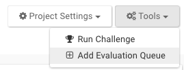

---

title: Evaluation Queues
layout: article
excerpt: An queue accepts submission of Synapse entities for evaluation. 
category: howto
---

An Evaluation queue allows for people to submit Synapse Files, Docker images, etc. for evaluation.  They are designed to support open-access data analysis and modeling challenges in Synapse. This framework provides tools for administrators to collect and analyze data models from Synapse users created for a specific goal or purpose.

## Create an Evaluation Queue

To create a queue, you must first create a Synapse project. To learn how to do so, please follow instructions [here](getting_started.md#project-and-data-management-on-synapse). An Evaluation Queue can take several parameters that you can use to fine tune it to your preferences. The minimum requirements to create a queue are:

* name – Unique name of the evaluation
* description – A short description of the evaluation
* contentSource – Synapse Project associated with the evaluation
* submissionReceiptMessage – Message to display to users upon submission
* submissionInstructionsMessage – Message to display to users detailing acceptable formatting for submissions.

Additionally, you can pass in an optional **quota** parameter using the R, Python, or web clients. It can be configured with the following terms:

* firstRoundStart - The date/time at which the first round begins in UTC
* roundDurationMillis -  The duration of each round in milliseconds
* numberOfRounds - The number of rounds, or null if there is no end
* submissionLimit - The maximum number of submissions per team/participant per round. Please keep in mind that the system will prevent additional submissions by a user/team once they have hit this number of submissions.



The example below shows how to create a queue using all of the parameters described:

##### Python

```python
import synapseclient

syn = synapseclient.login()

evaluation = synapseclient.Evaluation(name="My Unique Example Challenge Name",
    description="Short description of challenge queue",
    status="OPEN",
    contentSource="syn12345", # Your Synapse Project synID
    submissionInstructionsMessage="Instructions on submission format...",
    submissionReceiptMessage="Thanks for submitting to My Example Challenge!",
    quota={'submissionLimit':3, # The maximum number of submissions per team/participant per round.
        'firstRoundStart':'2017-11-02T07:00:00.000Z', # The date/time ("%Y-%m-%dT%H:%M:%S%Z") at which the first round begins in UTC.
        'roundDurationMillis':1645199000, #The duration of each round.
        'numberOfRounds':1} # The number of rounds, or null if there is no end. (Based on the duration of each round)
)

syn.store(evaluation)
```

##### R

```r
library(synapser)

synLogin()

evaluation <- Evaluation(name="My Unique Example Challenge Name",
    description="Short description of challenge queue",
    status="OPEN",
    contentSource="syn12345", # Your Synapse Project synID
    submissionInstructionsMessage="Instructions on submission format...",
    submissionReceiptMessage="Thanks for submitting to My Example Challenge!",
    quota=c(submissionLimit=3, # The maximum number of submissions per team/participant per round.
            firstRoundStart = '2017-11-02T07:00:00.000Z', # The date/time ("%Y-%m-%dT%H:%M:%S%Z") at which the first round begins in UTC.
            roundDurationMillis = 1645199000, # The duration of each round.
            numberOfRounds=1) # The number of rounds, or null if there is no end. (Based on the duration of each round)
    )

synStore(evaluation)
```

You can create Evaluation queues on the web by navigating to your challenge site by adding `/admin` to the url (E.g. www.synapse.org/#!Synapse:syn12345/admin).  Click **Tools** on the right corner and **Add Evaluation Queue** and follow the prompts.



In the web client, the quota can be modified under the **Challenge** tab by clicking `Edit` for the Evaluations that require a quota.

## Configure an Evaluation Queue

An Evaluation Queue can have limits. Submission "rounds" (start date, round duration, and number of rounds) with an optional submission quota (maximum submissions per participant or team) can be defined for each queue. There is no way to configure the round or quota settings of an Evaluation Queue from the web. The Evaluation ID can be found under the **Challenge** tab of your project. Please note that a Challenge tab will not appear on your project until you have created a challenge (**Tools > Run Challenge**). In the case below, the evaluation queue id is `9610091`.  


Using this value, we can configure the `quota` parameters of this evaluation queue with the R or Python client.  

##### Python

```python
import synapseclient
syn = synapseclient.login()
evalId = 9610091
evaluation = syn.getEvaluation(evalId)
evaluation.quota = {'submissionLimit':3} #The maximum number of submissions per team/participant per round.
syn.store(evaluation)
```

##### R

```r
library(synapser)
synLogin()

evalId = 9610091
evaluation <- synGetEvaluation(evalId)

evaluation$quota <- c('submissionLimit'=3) #The maximum number of submissions per team/participant per round.
synStore(evaluation)
```

## Share an Evaluation Queue

Each Evaluation has its own sharing settings, which limit who can interact with the Evaluation and in what way:

* "Administrator" sharing should be tightly restricted, as it includes authority to delete the entire Evaluation queue with all its contents. These users also have the ability to download all the submissions.
* "Can score" allows for individuals to download all the submissions
* "Can submit" allows for Teams or individuals to submit to the Evaluation, but doesn't have access to any of the submissions.
* "Can view" allows for Teams or individuals to view the submissions on a leaderboard.

To set the sharing setting, go to the **Challenge** tab and see your list of Evaluations.  Click on the `Share` button per Evaluation and share it with the Teams or individuals you would like.



## Submitting to an Evaluation Queue

Any Synapse Entity may be submitted to an Evaluation Queue.

##### Python

```python
import synapseclient

syn = synapseclient.login()

evaluation_id = "9610091"
my_submission_entity = "syn1234567"

submission = syn.submit(
    evaluation = evaluation_id,
    entity = my_submission_entity,
    name = "My Submission", # An arbitrary name for your submission
    team = "My Team Name") # Optional, can also pass a Team object or id
```

##### R

```r
library(synapser)

synLogin()

evaluation_id <- "9610091"
my_submission_entity <- "syn1234567"

submission <- synSubmit(
    evaluation = evaluation_id,
    entity = my_submission_entity,
    name = "My Submission", # An arbitrary name for your submission
    team = "My Team Name") # Optional, can also pass a Team object or id
```

## View Submissions of an Evaluation Queue

All submissions of an Evaluation queue can be views through the through the use of a leaderboard.  To learn how to create a wiki page, please visit [here](wikis.md).  Below are instructions on how to set up a leaderboard. You must know the **evaluation Id** to do so; see the section on how to "Configure an Evaluation Queue" for instructions on finding the evaluation Id.

### Adding Leaderboard Widget


### Configuring Leaderboard Widget

Once you click on **Leaderboard**, you will have to input your own query statement such as `select * from evaluation_9610091`.  Remember, 9610091 should be replaced with your own evaluation Id. To view all the columns available, click **Refresh Columns**.


Clicking **Refresh Columns** will add these default columns.


### Saving Leaderboard Widget

If you are happy with your leaderboard configurations, save both the configurations and the wiki page to see the Leaderboard.


