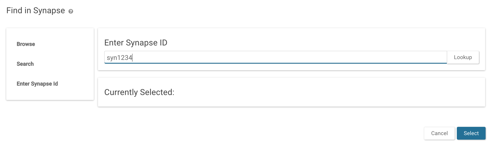
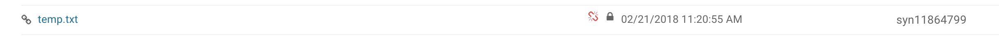

<style>
#toobig {
    width: 25%;
}
#image {
    width: 50%;
}
#link {
    width: 100%;
}
</style>

Synapse `Links` provide users the ability to create a link to any File, Table, Folder, or Project on Synapse. 

## Creating a Link

##### Web

Navigate to the file, table, folder or project you want to save a link of. Click Tools and Save Link to.


Select a folder or project that you want to save the link to (This feature is more like bookmarking the file to a specific location).



The final result looks like:



##### Python

```python
import synapseclient
syn = synapseclient.login()

# Add a local file to an existing project (syn12345) on Synapse
# targetId is the synapse id of the file, table, etc that you want to link
# targetVersion is optional, if no version is defined, the link will always point to the newest version
# parent is the folder or project where you want to link to exist
linkEnt = synapseclient.Link(targetId="syn12345", targetVersion=1, parent="syn2345")
linkEnt = syn.store(linkEnt)
```

##### R

```r
library(synapser)
synLogin()

# Add a local file to an existing project (syn12345) on Synapse
# targetId is the synapse id of the file, table, etc that you want to link
# targetVersion is optional, if no version is defined, the link will always point to the newest version
# parent is the folder or project where you want to link to exist
linkEnt <- Link(targetId="syn12345", targetVersion=1, parent="syn2345")
linkEnt <- synStore(linkEnt)
```

### See Also

[Annotations and Queries](annotation_and_query.md), [Downloading Data](downloading_data.md), [Files and Versioning](versioning.md)
