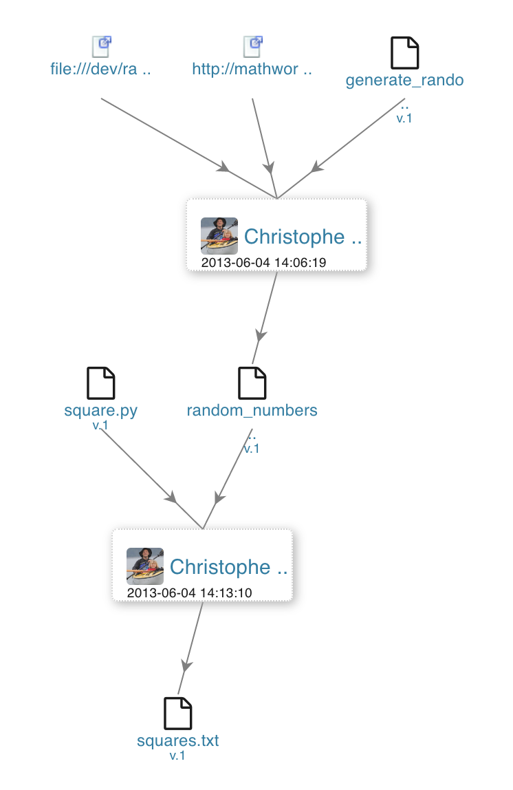
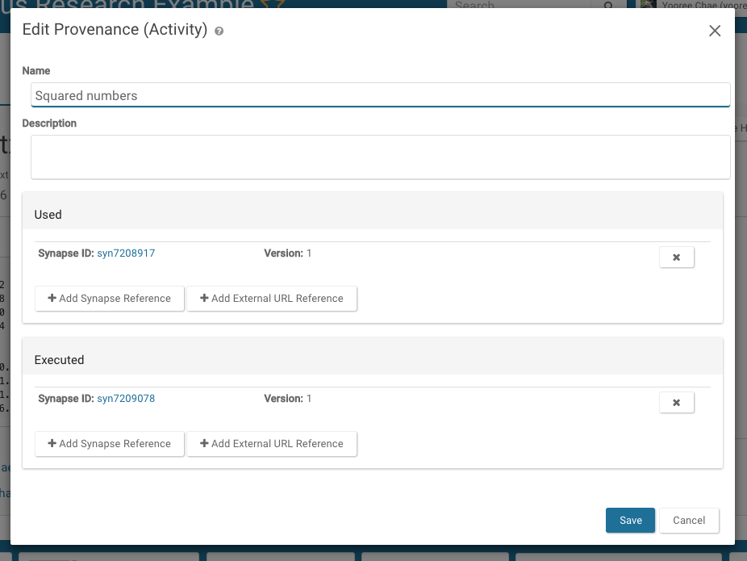
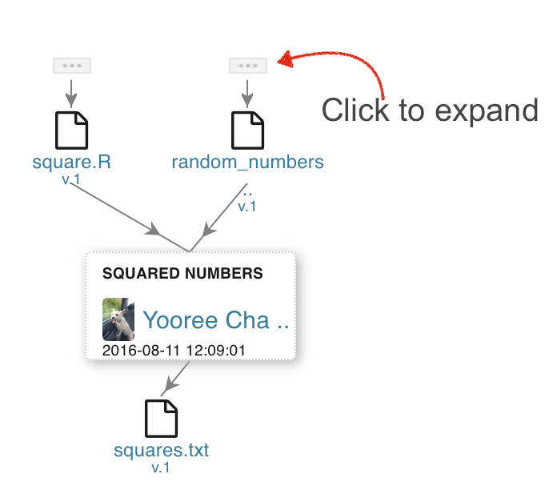

<style>
#image {
 width: 40%;
 border: 1px solid #1e7098;
}
#webTab {
 width: 90%;
}
</style>



Reproducible research is a fundamental responsibility of scientists, but the best practices for achieving it are not established in computational biology. The Synapse “Provenance” system is one of many solutions you can use to make your work reproducible by you and others.

Provenance is a concept describing the origin of something; in Synapse it is used to describe the connections between workflow steps that derive a particular file of results. Data analysis often involves multiple steps to go from a raw data file to a finished analysis.  Synapse’s Provenance Tools allow users to keep track of each step involved in an analysis, and share those steps with other users.

## The basic elements of Synapse provenance

The model Synapse uses for provenance is based on the [W3C provenance spec](https://www.w3.org/standards/techs/provenance#w3c_all) where items are derived from an **activity** which has components that were **used**  and components that were **executed**.  Think of the used items as input files and executed items as software or code.  Both used and executed can either be items in Synapse or URLs such as a link to a github commit or a link to specific version of a software tool.  

The Synapse clients for command line, Python, and R support creating and editing of provenance relationships. The Web client allows editing of provenance once the file has been uploaded.

On the right is a Synapse visualization of provenance relationships that is demonstrated in the following section using our programmatic and web clients. In this example, we have two scripts, one that generates random numbers and another that takes a list of numbers and computes their squares. The project's workflow looks like the image to the right.

### Setting Provenance When Uploading a File

Let's begin with a script that generates a list of normally distributed random numbers and saves the output to a file. 
For example, you have an R script file called [generate_random_data.R](https://www.synapse.org/#!Synapse:syn7205215) and you've saved the output to a data file called [random_numbers.txt](https://www.synapse.org/#!Synapse:syn7208917). We'll begin by uploading the files to Synapse and then set their provenance.  

#### Upload a file and add provenance

For this example, we'll use a `Project` that already exists ([*Wondrous Research Example* : syn1901847](https://www.synapse.org/#!Synapse:syn1901847/files/)). The [code file](https://www.synapse.org/#!Synapse:syn7205215) is already saved in Synapse with synId `syn7205215` so we'll upload the data file to this `Project`, or in Synapse terminology, the project will be the parent of the new entities.

As the [random_numbers.txt file](https://www.synapse.org/#!Synapse:syn7208917) was generated from the above script, we are going to specify this using provenance.

There are a couple ways to set provenance information for a Synapse entity. The `used` and `executed` arguments specify resources used and code executed in the process of creating the entity. Code can be stored in Synapse(as we did in the previous step) or, better yet, linked by URL to a source code versioning system like GitHub or SVN. As an example, we'll specify 2 somewhat contrived sources of provenance:

1. Synapse entity by synId: [syn7205215](https://www.synapse.org/#!Synapse:syn7205215) (the code file)
2. URL to a page describing [normal distributions](http://mathworld.wolfram.com/NormalDistribution.html)

##### Web



Navigate to the `File's` tab and click on the `File` that you would like to update. Click on the **Tools** dropdown in the upper right hand corner and select **Edit Provenance**. In the resulting pop-up, enter the relevant information.

##### Command Line

```console
synapse add random_numbers.txt --parentId syn1901847 --executed syn7205215 --used http://mathworld.wolfram.com/NormalDistribution.html
```

Alternatively in the command line client, if you have downloaded the file, you can specify a local path as such:

```console
synapse add random_numbers.txt --parentId syn1901847 --executed ./generate_random_data.R --used http://mathworld.wolfram.com/NormalDistribution.html
```

##### Python

```python
# Set provenance for data file generated by the script file
data_file = File(path="random_numbers.txt", parent="syn1901847")
data_file = syn.store(data_file, executed="syn7205215", used="http://mathworld.wolfram.com/NormalDistribution.html")
```

##### R

```r
# Set provenance for data file generated by the script file
data_file <- File(path="random_numbers.txt", parent="syn1901847")
data_file <- synStore(data_file, executed="syn7205215", used="http://mathworld.wolfram.com/NormalDistribution.html")
```

Once the data file is uploaded, it will provide the synId assigned to it. In this case, the data file's synId is `syn7208917`.


### Editing Provenance

To continue our example above, we'll now add some new results from our initial data file. We're going to take the results in random_numbers.txt and square them. The script to square the numbers will be [square.R](https://www.synapse.org/#!Synapse:syn7209078) and we'll save the output to a data file, [squares.txt](https://www.synapse.org/#!Synapse:syn7209166). As with the previous example, the code file is already saved in Synapse, so we'll upload the data file and set its provenance.

##### Web

To update the provenance on a file, navigate to the `File's` tab and click on the `File` that you would like to update. Click on the **Tools** dropdown in the upper right hand corner and select **Edit Provenance**. In the resulting pop-up, enter the relevant information.



##### Command Line

```console
# Add the data file to Synapse
synapse add squares.txt -parentId syn1901847 
# Set the provenance for newly created entity syn7209166 using synId
synapse set-provenance -id syn7209166 -executed syn7209078 -used syn7208917
# Set the provenance for newly created entity syn7209166 using local path
synapse set-provenance -id syn7209166 -executed ./square.R -used ./random_numbers.txt
```

##### Python

```python
# Add the data file to Synapse
squared_file = File(path="squares.txt", parentId="syn1901847")
squared_file = syn.store(squared_file)

# Set provenance for newly created entity syn7209166
squared_file = syn.setProvenance(squared_file, activity = Activity(used = "syn7208917", executed = "syn7209078"))
# Provenance can also be set using local variables instead of looking up synIds
squared_file = syn.setProvenance(squared_file, activity = Activity(used = data_file, executed = "syn7209078"))
```

##### R

```r
# Add the data file to Synapse
squared_file <- File(path="squares.txt", parentId="syn1901847")
squared_file <- synStore(squared_file)

# Set provenance for newly created entity syn7209166
act <- Activity(name = "Squared numbers", used = "syn7208917", executed = "syn7209078")
synStore(squared_file, activity=act)

# Provenance can also be set using local variables instead of looking up synIds
act <- Activity(name = "Squared numbers", used = data_file, executed = "syn7209078")
squared_file <- synStore(squared_file, activity=act)
```

### Deleting Provenance

If at any point you need to delete provenance on an entity, you can do so.
You must be the person who created the entity to delete provenance.

##### Web

Navigate to the entity you would like to delete provenance from (e.g. a File or Folder). In this example, we are deleting provenance from a file. Select **Tools->Edit File Provenance**. In the list of **Used** and **Executed**, click the **X** to delete each activity and **Save** your changes.


##### Command Line

Currently, deleting provenance is not supported in the command line client.

##### Python

```python
# Delete provenance on entity syn123 
delete_provenance = syn.deleteProvenance('syn123')
```

##### R

```r
# Delete provenance on entity syn123
deleteProvenance = synDeleteProvenance('syn123')
```

### Getting and Viewing Provenance

##### Web
Navigate to the `File's` page to view its provenance. Clicking on the triple dots above entities will expand it to show the `File's` full provenance.



##### Command Line

```console
synapse get-provenance -id syn7209166
```

##### Python

```python
provenance = syn.getProvenance("syn7209166")
provenance
```

##### R

```r
provenance <- synGetProvenance("syn7209166")
provenance
```

### Reusing an Provenance for Multiple Files

An `Activity` is a Synapse object that helps keep track of what objects were 'used' in an analysis step ... as well as what objects were generated. Thus, all relationships between Synapse objects and an `Activity` are governed by dependencies. That is, an `Activity` needs to know what it 'used' -- and outputs need to know what `Activity` they were 'generatedBy'. A couple of points for clarity:

* An `Activity` can 'use' many things (i.e. many inputs to an analysis)
* Many outputs can be 'generatedBy' the same `Activity`

If an activity isn't assigned to an entity and then stored, a separate graph will be created for each file that the activity generated. 
The following example is used to assign the same activity to multiple files resulting in one provenance graph:

##### Web

Unfortunately, the web interface currently does not support assigning the same activity to multiple files.

##### Command Line

Unfortunately, command line currently does not support assigning the same activity to multiple files.

##### Python

```python
# Code used to generate the file will be syn123456
# Files used to generate the information
expr_file = syn.get("syn246810", download=F)
filter_file = syn.get("syn135791", download=F)

# Activity to assign to multiple files
act = Activity(name="filtering",
                used=[expr_file, filter_file],
                executed="syn123456")
syn.store(final_file, activity=act)

# Get the activity now associated with an entity
act = syn.getProvenance(final_file)

# Now you can set this activity to as many files as you want (file1, file2, etc are Synapse Files)
file_list = [file_1, file_2, file_3]
file_list = map(lambda x: syn.store(x, activity=act), file_list)
```

##### R

```r
# Code used to generate the file will be syn123456
# Files used to generate the information
expr_file <- synGet("syn246810", download=F)
filter_file <- synGet("syn135791", download=F)

# Activity to assign to multiple files
act <- Activity(name="filtering",
                used=list(expr_file, filter_file),
                executed="syn123456")
finalFile <- synStore(finalFile, activity=act)

# Get the activity now associated with an entity
act <- synGetProvenance(finalFile)

# Now you can set this activity to as many files as you want (file1, file2, etc are Synapse Files)
finalList <- c(file1, file2, file3)
finalList <- lapply(finalList, function(x) synStore(x, activity=act))
```

### See Also

[Files and Versioning](versioning.md), [Annotations and Queries](annotation_and_query.md)
