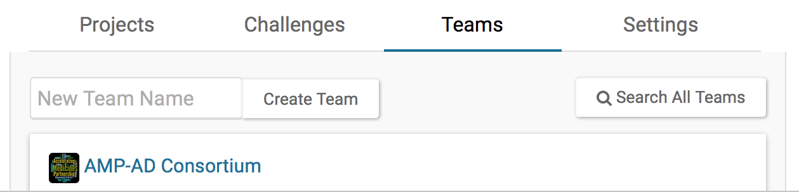
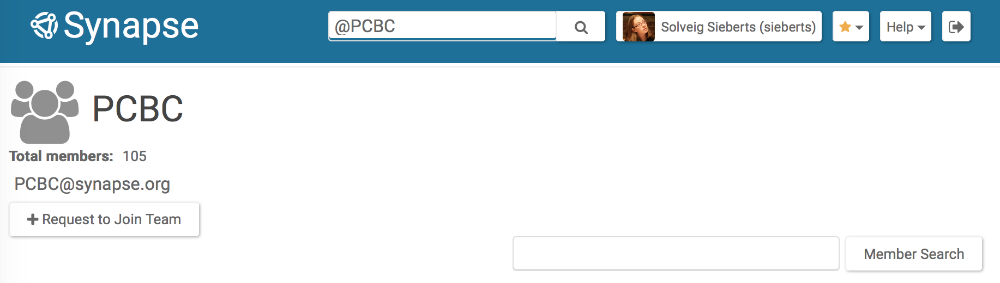

`Teams` are a way to easily manage groups of users for the purposes of project access, communication, and challenge participation. In this guide you will learn how to:

* Create and manage a team
* Invite users to join a team
* Find teams, and identify and manage the teams to which you belong
* Use teams for communications and project permissions
* Submit to a challenge as a team

 

A listing of all `Teams` to which you belong is available on the **Teams** tab of your [Profile Page](https://www.synapse.org/#!Profile:v), which can be accessed by clicking your name in the top right corner.

## Creating a Team

From your [Profile Page](https://www.synapse.org/#!Profile:v), which can be accessed by clicking your name in the top right corner, click on the **Teams** tab as seen below.

Enter a team name in the dialog box and click **Create Team**. If the team name already exists, you will be prompted to enter a new team name.

Once the `Team` is created, you will be taken to the `Team` page, where you can invite members, change settings, edit or delete the `Team`. By default, the user creating the `Team` is the Team Manager, the user with permissions to perform these changes. The Team Manager may designate additional Team Managers by changing the setting next to the users' name.

## Managing a Team

For `Teams` for which you are a Team Manager, you may invite or delete `Team` members and edit `Team` settings, from the `Team` page. The **Tools** menu button in the upper right corner of the page will provide tasks you can perform for managing a `Team`.

### Invite or Remove Users

Using the **Invite Users** option, you can find and invite registered Synapse users to join your `Team`. You can search by Synapse user name, or, if the user has entered, their first and last name. Users will be sent an email indicating they have been invited to join the `Team` and must confirm the invitation prior to being included.

You can also invite users by email by entering the email of the person whom you want to invite. They will recieve an email indicating they have been invited to join the `Team` and must confirm the invitation prior to being included. If they have a Synapse account associated with the email address, they will be able to log in and join the `Team`. If they do not have a Synapse account associated with the email address, they will be prompted to create one prior to joining the `Team`.

You may also remove team members by clicking the **Remove** button next to a member, or promote additional team members to Team Manager, by clicking the option list below the member.

### Edit Team

Using this option, you can edit the `Team` name, the `Team` description, the `Team` icon, and change `Team` settings. This includes allowing users to join the team without a Team Manager's permission (the default is to require Team Manager's permission). You can also change team email preferences. This setting can allow Synapse users who are not in the `Team` to email the `Team`. See the section below "Communications and Project Permissions" for more information about team emails.

### Delete a Team

Use the **Delete Team** option to delete all references to the `Team`. If a `Team` has Synapse content shared with it (see "Communications and Project Permissions" below), the `Team` cannot be deleted.

## Finding Teams

You may search for Synapse `Teams` using the **Search All Teams** button on the **Teams** tab of your User Profile Page. You may also search `Teams` using the general search box in the header of each Synapse page by prefacing the search with **@** (e.g. @PCBC), or use the [Team Search Page](https://www.synapse.org/#!TeamSearch:).

### Join a Team

For `Teams` to which you do not belong, you may view the team members and contact information, as well as request to join the `Team` via the **Request to Join Team** button on the `Team` page.

### Leave a Team

Use the **Leave Team** option to be removed from a `Team`. If you want to re-join the `Team`, you may need the Team Manager's permission to join.

## Search for Members

You may search among team members by name or Synapse user name using the search box on the upper right side of the `Team` page.

## Communications and Project Permissions

Each `Team` has an email address which can be used to message the team members. This address is found on the team page. Each team member will be reached at the email address they have registered with Synapse.

You may use `Teams` to manage Sharing Settings on `Files`, `Folders` and `Projects`. From the **Share** button you may add `Teams` in addition to individuals. Each member of the `Team` will receive the **Sharing Setting** specified for the `Team`.

## Submitting to a Challenge as a Team

When participating in a Challenge, you may submit solutions as an individual or as a `Team`. The `Team` must be registered with the challenge, which can be done by clicking the **Register a Team** button, typically on the **Forming a Team** page on the challenge wiki. When submitting a `File` to a challenge from the Web Client, you will be given the option to submit the `File` as part of a `Team`. You will then be asked to select from the registered `Teams` of which you are a member, or register an existing `Team` with the challenge, and to verify which team members contributed to the solution. Note that only members who have already registered with the challenge may be selected.

### See Also

[Wikis](wikis.md), [Files and Versioning](versioning.md), [Sharing Settings](access_controls.md)
