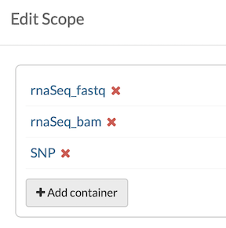
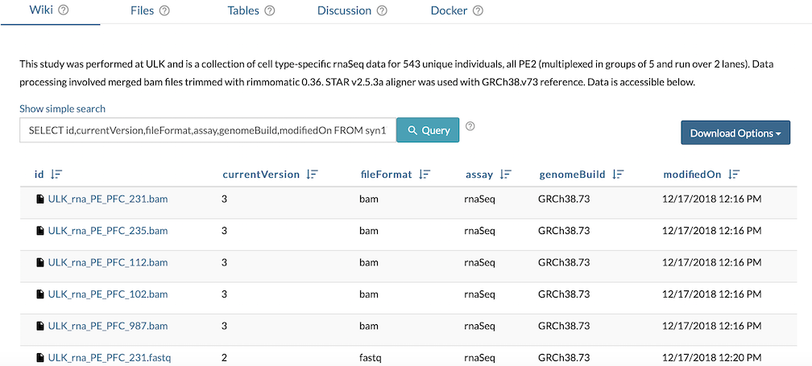

## Use a Wiki Table Widget to Feature a Data Subset

`Wiki` widgets are tools to support narrative content. Embedded `Wiki` `Tables` can enable quick access to `Files` of highest importance and orient users to the resources contained in a collaborative project. `Wiki` `Tables` accept queries of existing `Tables` or `File Views`, providing a strategy to restrict scope and focus content.

More information on related concepts is available on the [Tables](tables.md), [Making a Project](making_a_project.md), [Views](views.md) and [Wikis](wikis.md) pages.

## Start with a File View or Table

The [Views](views.md) page provides steps to list `Files` and `Folders` within `Views` and `Tables`. This will be the content embedded in the `Wiki`.

## Focus Scope

A `Project` can contain multiple studies, various assays and extensive `Files`, obscuring relevant data under a large file hierarchy. For this use case, an individual assay type is meant to be accessible from the `Wiki`, as the assay-relevant data is a subset of a broader study. The objective of highlighting .fastq and .bam rnaSeq files in an embedded `Table` is to provide an analyst a clear path to access files for reproducible studies.

This study contains rnaSeq and SNP genomic data, as depicted in the fileview scope below. The scope can be further restricted to rnaSeq-specific data with [additional queries](https://docs.synapse.org/rest/org/sagebionetworks/repo/web/controller/TableExamples.html) on the embedded `Table`.



## Restrict Query

A `Table` query is required to embed a `Wiki` `Table`. As the fileview is a combination of multiple assay types from a single study, the query must be restricted to isolate relevant rnaSeq entries. Additionally, columns visible can be limited to ensure only imperitive information is visible in the `Wiki`.

```sql
SELECT id,currentVersion,fileFormat,assay,genomeBuild,modifiedOn FROM syn17097374 WHERE "assay" = 'rnaSeq' AND "fileFormat" = 'bam' OR "fileFormat" = 'fastq'
```

## Embed Table

Navigate to **Wiki Tools** to **Edit Project Wiki** or to **Folder Tools** to **Edit Folder Wiki**. From the edit `Wiki` view, select **Insert** and **Table:Query on a Synapse Table/View** to insert the intended `File View` query. The result is a direct link to relevant files from a `Wiki` page with narrative content to provide additional context.


