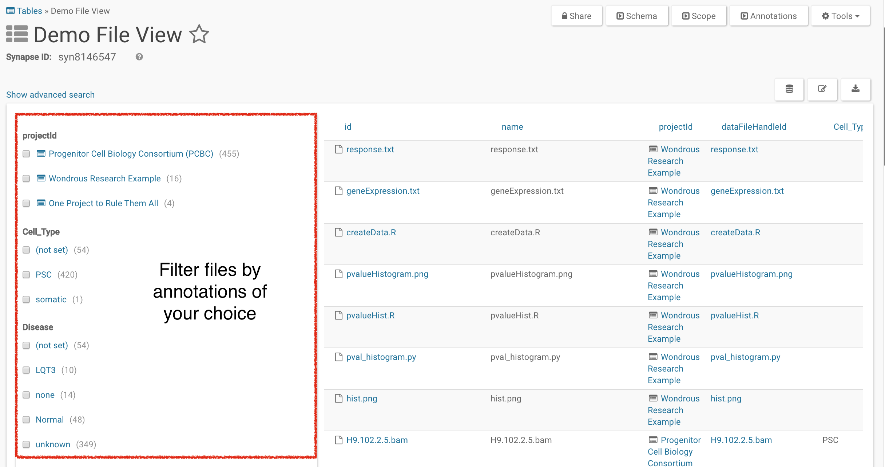
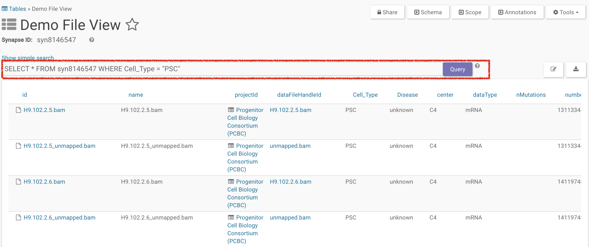
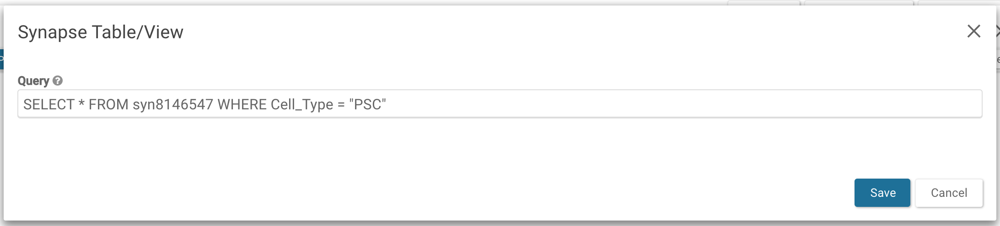

A view is a type of Synapse [Table](tables.md) that queries across metadata ([Annotations](annotation_and_query.md)) for particular items (currently: projects or files) with a particular "scope". A `File View` lists all `Files` or `Tables` within one or more `Folders` or `Projects`. A `Project View` lists all `Projects` you've added to the view. Views can:

* Allow `Projects`, `Files`, and `Tables` to be easily searched and queried
* Allow view/editing metadata attributes in bulk
* Provide a way of isolating or linking data based on similarities
* Provide the ability to link `Projects`, `Files`, and `Tables` together by their annotations

## Create a File View

To create a `File View`, select the `Project` in which you would like to create the view. The `Project` you choose does not have to contain the files you are including in your view. You will select the files of interest by defining the scope, which is the `Project(s)` and `Folders` that contain your files. "File Views" can also contain `Tables` or `Folders`; you can choose which kinds of items you would like to include during this process.



Instructions for creating `Views` using the clients can be found in the [Python docs](https://python-docs.synapse.org/build/html/Views.html) and in the [R docs](https://r-docs.synapse.org/articles/views.html).

## Create a Project View

To create a `Project View`, select the `Project` in which you would like to create the view. You will select the projects of interest by defining the scope as above. The only notable difference between creating a `Project View` and a `File View` is that for project views, there is a 1:1 relationship between the projects you select in your scope and the projects that are shown in the view.

## Updating the Scope or Content-Type of a View

Views can be edited to change the scope of the view (e.g. the Project or Folder the view is showing) or which types of content is shown. Both of these options are found by navigating to "Show Scope of View" in the Tools menu; from there you may View and Edit the scope and the content-type of the view.

Note that it may take a few moments for the updated View to rebuild as it queries across the system.

## Query a View

A view can be queried exactly the same as any other `Table` in Synapse. Please see [Tables](tables.md) for more examples. See the [Using Simple Search](views.md#using-simple-search) and [Using Advanced Search](views.md#using-advanced-search) sections below.

For example, to query for everything in `syn123`:

##### Command Line

```console
synapse query 'SELECT * FROM syn123'
```

##### Python

```python
query = syn.tableQuery('SELECT * FROM syn123')
```

##### R

```r
query <- synTableQuery('SELECT * FROM syn123')
```

## Update Annotations in Bulk

Views can be used to update annotations in bulk. To add new annotations, see the [Annotations](annotation_and_query.md#adding-annotations) article. To update other metadata in bulk, such as provenance, see the [Bulk Processing](uploading_in_bulk.md) article.

<iframe width="100%" height="480" src="https://www.youtube.com/embed/ij9AqLsoDk0?rel=0" frameborder="0" allowfullscreen></iframe>

For example, if you would like to use the Python client to update the annotation `dogSays`:`bark` to `dogSays`:`woof` in every file in a `File View` with the synId syn456, you can do:

```python
from synapseclient import Table

foo = syn.tableQuery('select * from syn456')

bar = foo.asDataFrame()

# add in annotation as a column
bar['dogSays'] = 'woof'

# store the fileview with the new annotation in Synapse
fv = syn.store(synapseclient.Table(foo.tableId, bar))
```

### Using Simple Search

Views are in `Simple Search` mode by default. You can filter out `Projects` or `Files` of interest by selecting what characteristics you like using the facet menu on the left. You can toggle between simple and advanced search using the `Show advanced search/Show simple search` link.



### Using Advanced Search

In advanced search, you can use a SQL-like query to search for items in that view. In the example below, we're selecting for all files that have a `Cell Type` of `PSC`.



## Insert a View into a Wiki

Views can also be placed inside a [`Wiki`](wikis.md) once they have been created. You can embed the entire view or a subset of a query on it.

To insert a file view with a synId of `syn8146547`:

In the **Edit Project Wiki** window, select **Table: Query on a Synapse Table/View** under the **Insert** dropdown. To embed the entire file view into the wiki enter `SELECT * FROM syn8146547` in the resulting pop-up.

To embed a subset of the file view, like the advanced search query in the previous example, enter `SELECT * FROM syn8146547 WHERE Cell_Type = 'PSC'`.



Save the query and the edits to the `Wiki` to embed the view.

# See Also

[Annotations and Queries](annotation_and_query.md), [Tables](tables.md), [Wikis](wikis.md)
